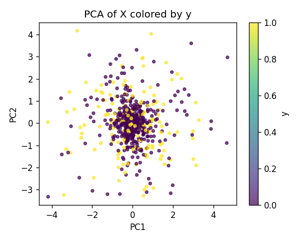
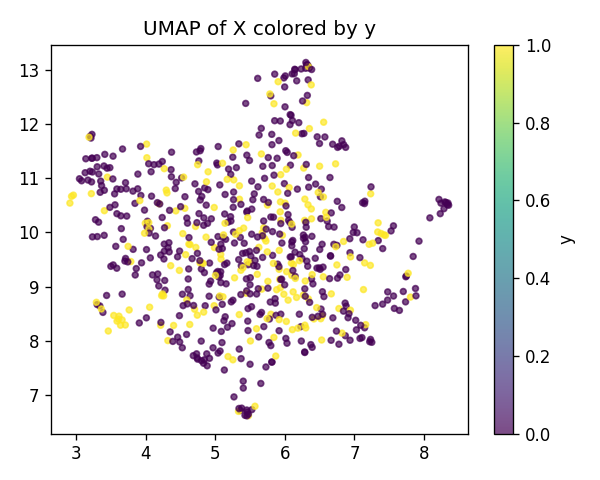
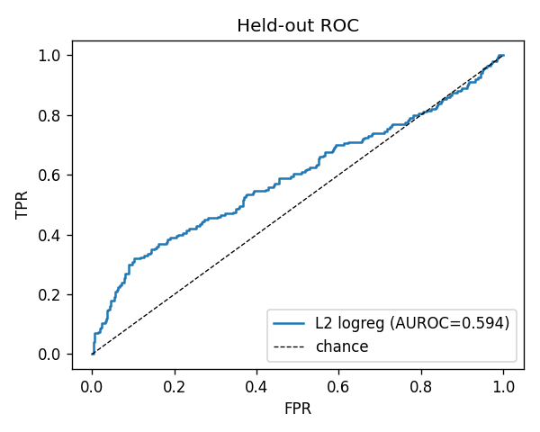
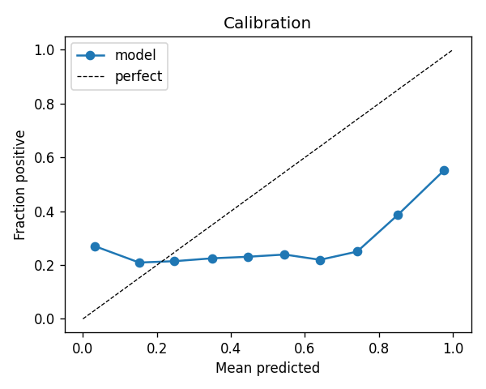
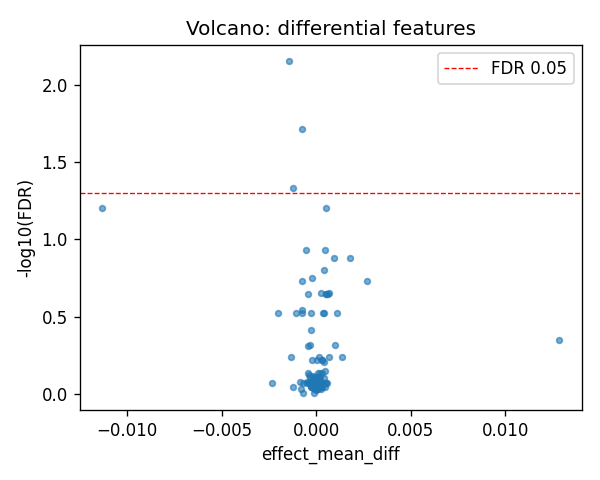
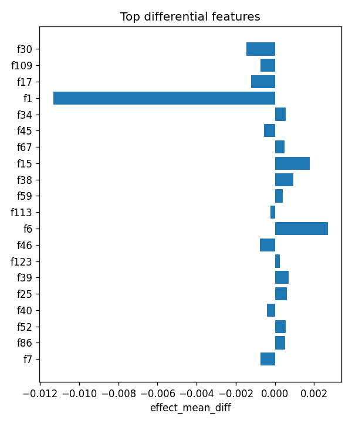

# aim1_sv :: a_coding_disrupting_vs_not

- task: **classification**, samples: 700, features: 128, groups: 24
- split: **GroupKFold** (5 folds), seed 0

## Held-out performance (point [95% CI])

| model | auroc | auprc |
|---|---|---|
| features / l2_logreg | 0.586 [0.524, 0.654] | 0.437 [0.369, 0.537] |
| features / hist_gbt | 0.691 [0.655, 0.737] | 0.452 [0.389, 0.532] |

### Confound control

| model | auroc | auprc |
|---|---|---|
| covariates-only / l2_logreg | 0.802 [0.770, 0.837] | 0.674 [0.621, 0.729] |
| covariates-only / hist_gbt | 0.806 [0.773, 0.838] | 0.670 [0.594, 0.737] |
| features-residualized / l2_logreg | 0.418 [0.369, 0.466] | 0.265 [0.228, 0.320] |
| features-residualized / hist_gbt | 0.653 [0.615, 0.702] | 0.401 [0.340, 0.482] |

*Interpretation:* features add signal beyond the covariates only if **features-residualized** stays above chance and the raw **features** model beats **covariates-only**.

## Permutation test (label-shuffle null)

- metric: **auroc** (l2_logreg); permute within groups: True
- observed = **0.586**, null = 0.499 ± 0.031 (n=1000)
- **p-value = 0.004995**

## Differential features (BH-FDR)

- significant at FDR<0.05: **3** of 128

| feature   |   stat_mannwhitney_u |   effect_mean_diff |     p_value |   p_adj_bh | direction   |
|:----------|---------------------:|-------------------:|------------:|-----------:|:------------|
| f30       |                40255 |       -0.00144698  | 5.53684e-05 | 0.00708715 | down        |
| f109      |                41271 |       -0.000734385 | 0.000304591 | 0.0194938  | down        |
| f17       |                42112 |       -0.00120478  | 0.00110082  | 0.0469683  | down        |
| f1        |                42549 |       -0.0113178   | 0.00205201  | 0.0626805  | down        |
| f34       |                57323 |        0.000541588 | 0.00244846  | 0.0626805  | up          |
| f45       |                43341 |       -0.000551417 | 0.00587076  | 0.117094   | down        |
| f67       |                56590 |        0.000474903 | 0.0064036   | 0.117094   | up          |
| f15       |                56283 |        0.00176768  | 0.00934015  | 0.132838   | up          |
| f38       |                56296 |        0.000950946 | 0.00919481  | 0.132838   | up          |
| f59       |                56051 |        0.000389146 | 0.0123021   | 0.157467   | up          |
| f113      |                44134 |       -0.00023382  | 0.015232    | 0.177245   | down        |
| f6        |                55689 |        0.0026928   | 0.0185935   | 0.187605   | up          |
| f46       |                44333 |       -0.000776122 | 0.0190536   | 0.187605   | down        |
| f123      |                55448 |        0.000248707 | 0.0242044   | 0.221297   | up          |
| f39       |                55371 |        0.000685412 | 0.0262825   | 0.224277   | up          |

## Plots

- 
- 
- 
- 
- 
- 
