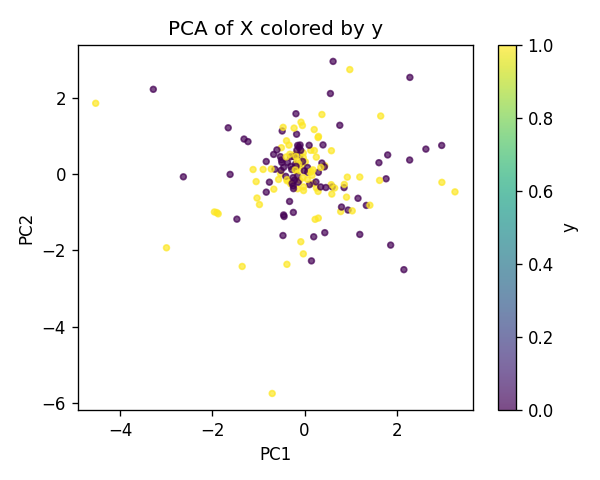
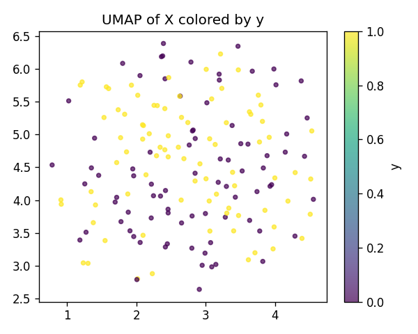
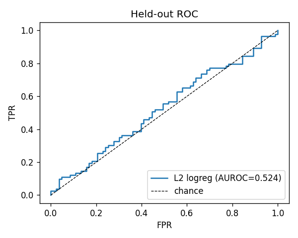
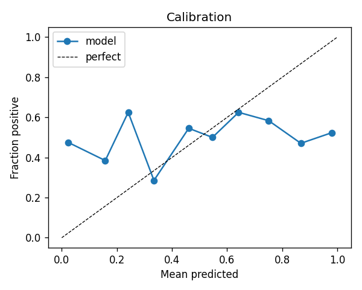
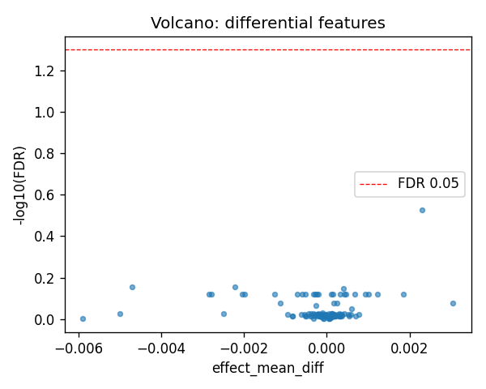
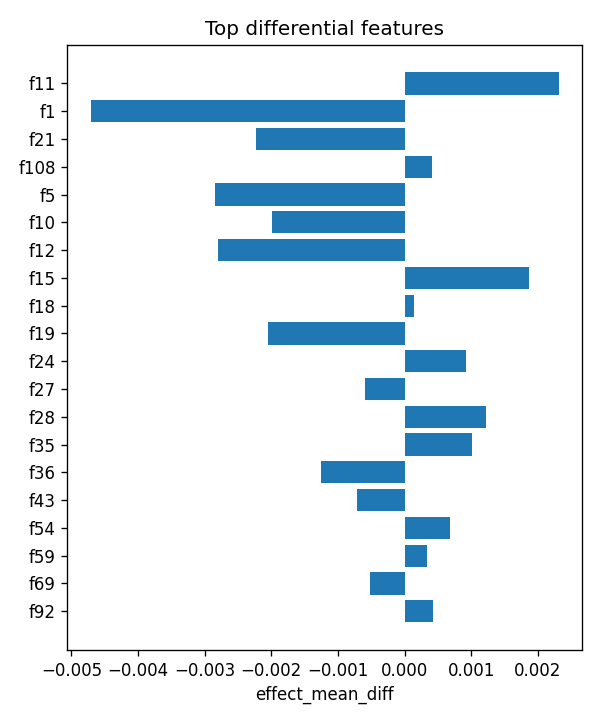

# aim1_sv :: b_coding_vs_intergenic_lenmatched

- task: **classification**, samples: 166, features: 128, groups: 24
- split: **GroupKFold** (5 folds), seed 0

## Held-out performance (point [95% CI])

| model | auroc | auprc |
|---|---|---|
| features / l2_logreg | 0.547 [0.480, 0.636] | 0.527 [0.426, 0.650] |
| features / hist_gbt | 0.517 [0.420, 0.599] | 0.533 [0.416, 0.679] |

### Confound control

| model | auroc | auprc |
|---|---|---|
| covariates-only / l2_logreg | 0.991 [0.977, 0.999] | 0.993 [0.979, 0.999] |
| covariates-only / hist_gbt | 0.987 [0.964, 0.999] | 0.986 [0.963, 0.999] |
| features-residualized / l2_logreg | 0.049 [0.021, 0.085] | 0.319 [0.239, 0.407] |
| features-residualized / hist_gbt | 0.394 [0.310, 0.517] | 0.434 [0.321, 0.576] |

*Interpretation:* features add signal beyond the covariates only if **features-residualized** stays above chance and the raw **features** model beats **covariates-only**.

## Permutation test (label-shuffle null)

- metric: **auroc** (l2_logreg); permute within groups: True
- observed = **0.547**, null = 0.518 ± 0.051 (n=1000)
- **p-value = 0.2957**

## Differential features (BH-FDR)

- significant at FDR<0.05: **0** of 128

| feature   |   stat_mannwhitney_u |   effect_mean_diff |    p_value |   p_adj_bh | direction   |
|:----------|---------------------:|-------------------:|-----------:|-----------:|:------------|
| f11       |                 4388 |        0.00230943  | 0.00232254 |   0.297285 | up          |
| f1        |                 2701 |       -0.00470798  | 0.0164119  |   0.700243 | down        |
| f21       |                 2662 |       -0.00222397  | 0.0115508  |   0.700243 | down        |
| f108      |                 4153 |        0.00041253  | 0.02222    |   0.71104  | up          |
| f5        |                 2835 |       -0.00284553  | 0.0492003  |   0.759965 | down        |
| f10       |                 2974 |       -0.00199013  | 0.129032   |   0.759965 | down        |
| f12       |                 2863 |       -0.00279614  | 0.0605974  |   0.759965 | down        |
| f15       |                 4023 |        0.00186109  | 0.0619389  |   0.759965 | up          |
| f18       |                 3959 |        0.000145949 | 0.0969073  |   0.759965 | up          |
| f19       |                 2885 |       -0.00204695  | 0.0710169  |   0.759965 | down        |
| f24       |                 3902 |        0.000925999 | 0.139958   |   0.759965 | up          |
| f27       |                 2906 |       -0.00059969  | 0.0822907  |   0.759965 | down        |
| f28       |                 4019 |        0.0012265   | 0.0637658  |   0.759965 | up          |
| f35       |                 3908 |        0.00101381  | 0.13483    |   0.759965 | up          |
| f36       |                 2782 |       -0.00126206  | 0.0325149  |   0.759965 | down        |

## Plots

- 
- 
- 
- 
- 
- 
