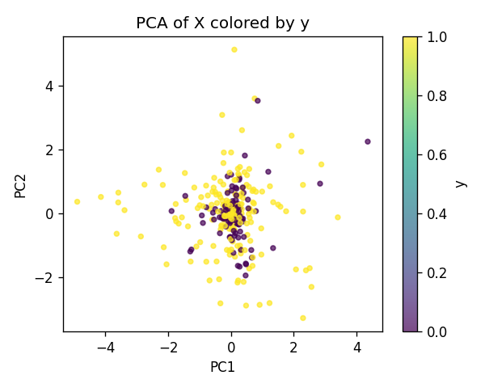
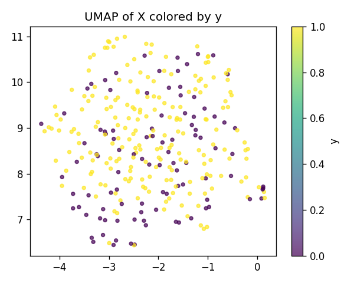
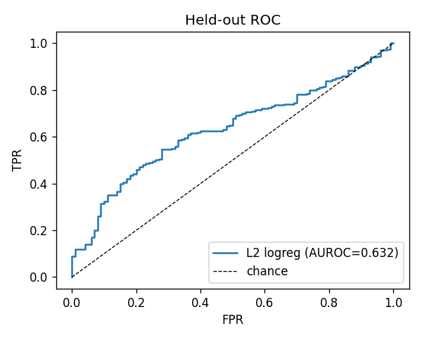
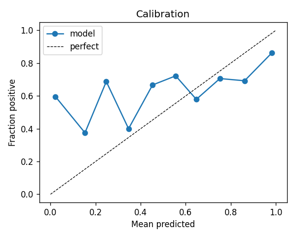
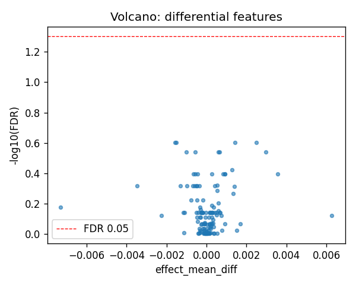
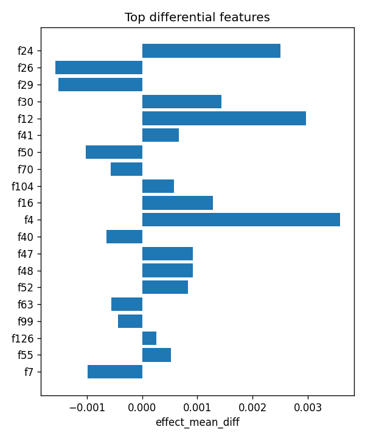

# aim1_sv :: c_coding_vs_intergenic_raw

- task: **classification**, samples: 300, features: 128, groups: 24
- split: **GroupKFold** (5 folds), seed 0

## Held-out performance (point [95% CI])

| model | auroc | auprc |
|---|---|---|
| features / l2_logreg | 0.610 [0.548, 0.675] | 0.759 [0.679, 0.836] |
| features / hist_gbt | 0.663 [0.609, 0.720] | 0.771 [0.687, 0.844] |

### Confound control

| model | auroc | auprc |
|---|---|---|
| covariates-only / l2_logreg | 0.990 [0.982, 0.997] | 0.995 [0.990, 0.999] |
| covariates-only / hist_gbt | 0.992 [0.980, 0.998] | 0.995 [0.990, 0.999] |
| features-residualized / l2_logreg | 0.263 [0.221, 0.300] | 0.557 [0.501, 0.631] |
| features-residualized / hist_gbt | 0.678 [0.606, 0.751] | 0.757 [0.665, 0.845] |

*Interpretation:* features add signal beyond the covariates only if **features-residualized** stays above chance and the raw **features** model beats **covariates-only**.

## Permutation test (label-shuffle null)

- metric: **auroc** (l2_logreg); permute within groups: True
- observed = **0.610**, null = 0.483 ± 0.046 (n=1000)
- **p-value = 0.001998**

## Differential features (BH-FDR)

- significant at FDR<0.05: **0** of 128

| feature   |   stat_mannwhitney_u |   effect_mean_diff |    p_value |   p_adj_bh | direction   |
|:----------|---------------------:|-------------------:|-----------:|-----------:|:------------|
| f24       |                12094 |        0.00250525  | 0.00311926 |   0.249564 | up          |
| f26       |                 8096 |       -0.00156935  | 0.00719934 |   0.249564 | down        |
| f29       |                 8115 |       -0.00151774  | 0.00779889 |   0.249564 | down        |
| f30       |                11917 |        0.0014309   | 0.0068133  |   0.249564 | up          |
| f12       |                11741 |        0.0029593   | 0.0139968  |   0.287905 | up          |
| f41       |                11673 |        0.000667559 | 0.018209   |   0.287905 | up          |
| f50       |                 8306 |       -0.00102097  | 0.0168031  |   0.287905 | down        |
| f70       |                 8326 |       -0.000569482 | 0.0181398  |   0.287905 | down        |
| f104      |                11645 |        0.000582303 | 0.0202433  |   0.287905 | up          |
| f16       |                11542 |        0.00127709  | 0.0295264  |   0.377938 | up          |
| f4        |                11386 |        0.00357536  | 0.0504492  |   0.402182 | up          |
| f40       |                 8643 |       -0.000641645 | 0.0554681  |   0.402182 | down        |
| f47       |                11446 |        0.000918087 | 0.041266   |   0.402182 | up          |
| f48       |                11351 |        0.000920508 | 0.0565568  |   0.402182 | up          |
| f52       |                11378 |        0.000833553 | 0.0517942  |   0.402182 | up          |

## Plots

- 
- 
- 
- 
- 
- 
