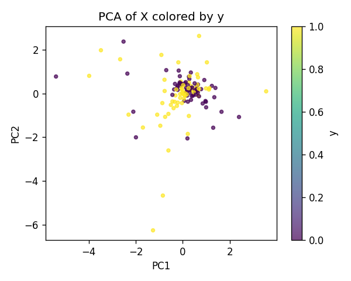
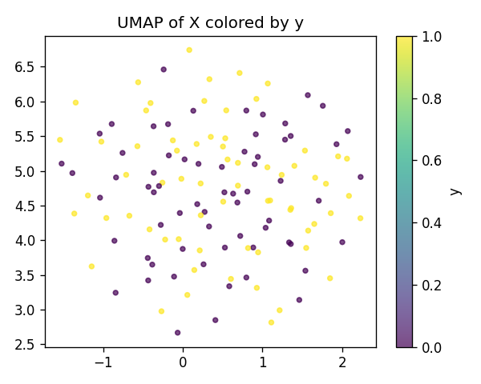
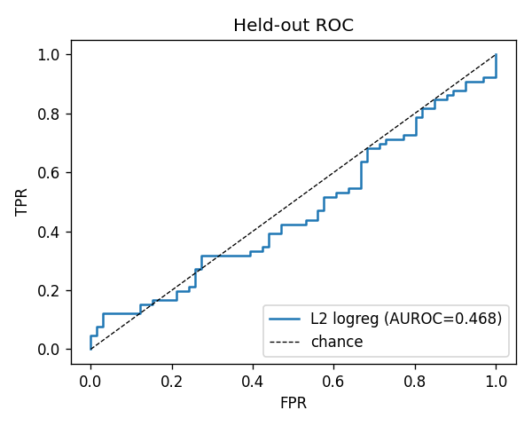
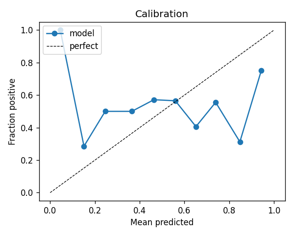
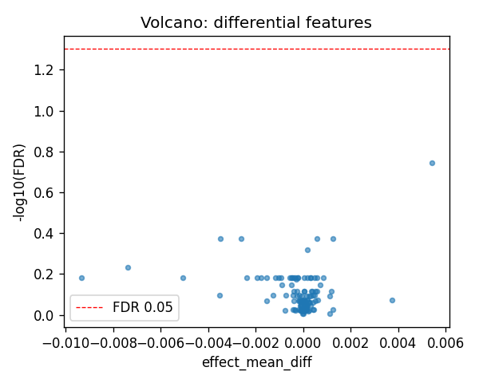
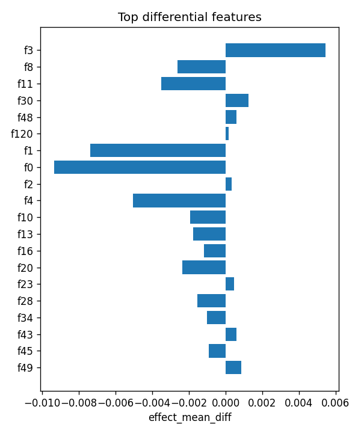

# aim1_sv :: pair_cds_vs_intergenic_lenmatched

- task: **classification**, samples: 132, features: 128, groups: 23
- split: **GroupKFold** (5 folds), seed 0

## Held-out performance (point [95% CI])

| model | auroc | auprc |
|---|---|---|
| features / l2_logreg | 0.432 [0.335, 0.570] | 0.496 [0.392, 0.631] |
| features / hist_gbt | 0.581 [0.502, 0.680] | 0.552 [0.412, 0.752] |

### Confound control

| model | auroc | auprc |
|---|---|---|
| covariates-only / l2_logreg | 0.995 [0.986, 1.000] | 0.996 [0.984, 1.000] |
| covariates-only / hist_gbt | 0.975 [0.937, 1.000] | 0.985 [0.951, 1.000] |
| features-residualized / l2_logreg | 0.014 [0.002, 0.032] | 0.312 [0.226, 0.416] |
| features-residualized / hist_gbt | 0.460 [0.376, 0.568] | 0.494 [0.363, 0.642] |

*Interpretation:* features add signal beyond the covariates only if **features-residualized** stays above chance and the raw **features** model beats **covariates-only**.

## Permutation test (label-shuffle null)

- metric: **auroc** (l2_logreg); permute within groups: True
- observed = **0.432**, null = 0.437 ± 0.050 (n=1000)
- **p-value = 0.5245**

## Differential features (BH-FDR)

- significant at FDR<0.05: **0** of 128

| feature   |   stat_mannwhitney_u |   effect_mean_diff |    p_value |   p_adj_bh | direction   |
|:----------|---------------------:|-------------------:|-----------:|-----------:|:------------|
| f3        |                 2880 |        0.00543903  | 0.00140984 |   0.180459 | up          |
| f8        |                 1651 |       -0.00262508  | 0.016567   |   0.424115 | down        |
| f11       |                 1611 |       -0.00349407  | 0.00993094 |   0.424115 | down        |
| f30       |                 2707 |        0.00123914  | 0.01616    |   0.424115 | up          |
| f48       |                 2721 |        0.000593875 | 0.0135492  |   0.424115 | up          |
| f120      |                 2680 |        0.000169327 | 0.0224657  |   0.479269 | up          |
| f1        |                 1706 |       -0.0073744   | 0.0318837  |   0.583016 | down        |
| f0        |                 1732 |       -0.00935278  | 0.0426076  |   0.655539 | down        |
| f2        |                 2516 |        0.000323965 | 0.124535   |   0.655539 | up          |
| f4        |                 1760 |       -0.00505897  | 0.0574195  |   0.655539 | down        |
| f10       |                 1798 |       -0.00192974  | 0.0841389  |   0.655539 | down        |
| f13       |                 1790 |       -0.00178347  | 0.0778045  |   0.655539 | down        |
| f16       |                 1835 |       -0.00116914  | 0.119051   |   0.655539 | down        |
| f20       |                 1845 |       -0.00237693  | 0.130215   |   0.655539 | down        |
| f23       |                 2566 |        0.000470454 | 0.0778045  |   0.655539 | up          |

## Plots

- 
- 
- 
- 
- 
- 
