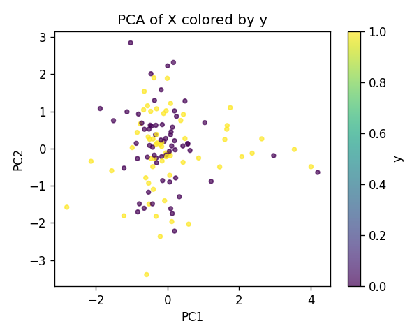
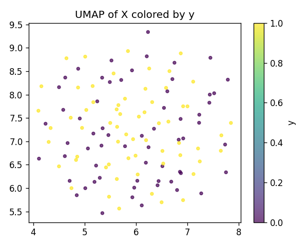
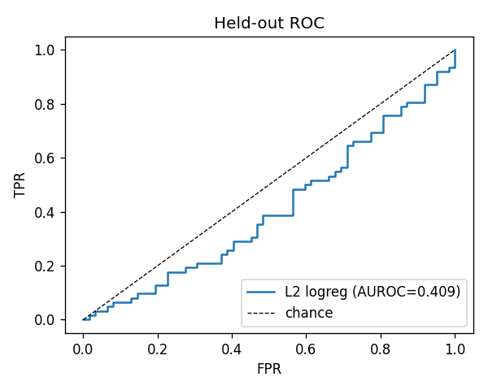
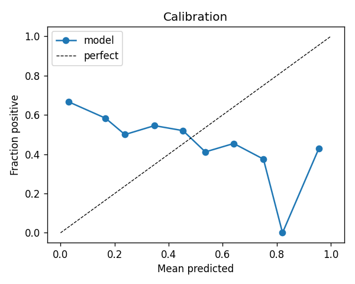
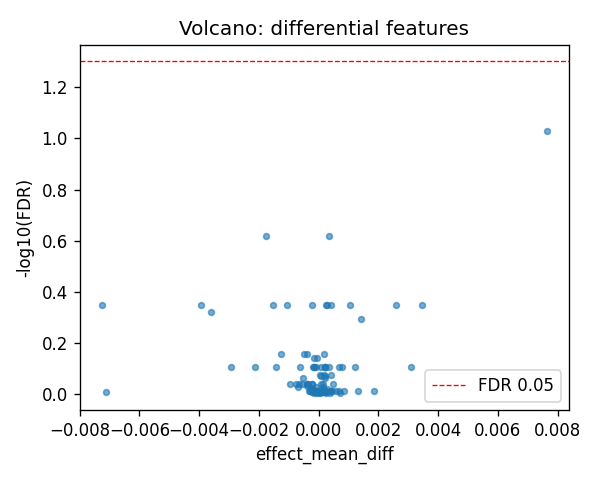
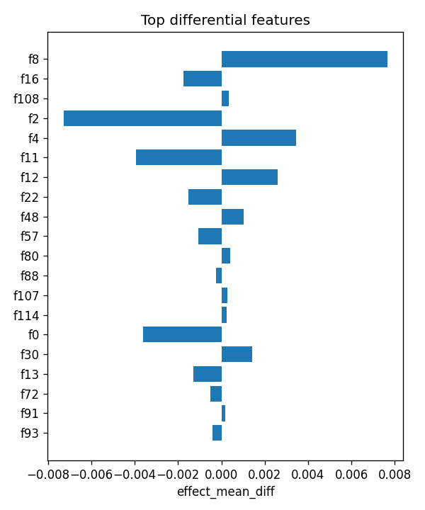

# aim1_sv :: pair_cds_vs_intronic_lenmatched

- task: **classification**, samples: 124, features: 123, groups: 23
- split: **GroupKFold** (5 folds), seed 0

## Held-out performance (point [95% CI])

| model | auroc | auprc |
|---|---|---|
| features / l2_logreg | 0.362 [0.255, 0.455] | 0.422 [0.307, 0.566] |
| features / hist_gbt | 0.514 [0.394, 0.634] | 0.523 [0.364, 0.704] |

### Confound control

| model | auroc | auprc |
|---|---|---|
| covariates-only / l2_logreg | 0.830 [0.724, 0.927] | 0.859 [0.733, 0.939] |
| covariates-only / hist_gbt | 0.736 [0.651, 0.843] | 0.754 [0.623, 0.867] |
| features-residualized / l2_logreg | 0.174 [0.072, 0.279] | 0.346 [0.249, 0.458] |
| features-residualized / hist_gbt | 0.338 [0.245, 0.443] | 0.400 [0.299, 0.529] |

*Interpretation:* features add signal beyond the covariates only if **features-residualized** stays above chance and the raw **features** model beats **covariates-only**.

## Permutation test (label-shuffle null)

- metric: **auroc** (l2_logreg); permute within groups: True
- observed = **0.362**, null = 0.445 ± 0.044 (n=1000)
- **p-value = 0.976**

## Differential features (BH-FDR)

- significant at FDR<0.05: **0** of 123

| feature   |   stat_mannwhitney_u |   effect_mean_diff |     p_value |   p_adj_bh | direction   |
|:----------|---------------------:|-------------------:|------------:|-----------:|:------------|
| f8        |                 2596 |        0.00764787  | 0.000763366 |   0.093894 | up          |
| f16       |                 1367 |       -0.00175304  | 0.00558746  |   0.239856 | down        |
| f108      |                 2474 |        0.000341364 | 0.00585014  |   0.239856 | up          |
| f2        |                 1520 |       -0.00725875  | 0.0448077   |   0.448067 | down        |
| f4        |                 2393 |        0.00344954  | 0.0187092   |   0.448067 | up          |
| f11       |                 1510 |       -0.00394057  | 0.0397412   |   0.448067 | down        |
| f12       |                 2313 |        0.00259331  | 0.0509995   |   0.448067 | up          |
| f22       |                 1530 |       -0.00152728  | 0.0504085   |   0.448067 | down        |
| f48       |                 2362 |        0.00103314  | 0.0280664   |   0.448067 | up          |
| f57       |                 1435 |       -0.0010527   | 0.0150475   |   0.448067 | down        |
| f80       |                 2315 |        0.000420117 | 0.0498232   |   0.448067 | up          |
| f88       |                 1520 |       -0.000235976 | 0.0448077   |   0.448067 | down        |
| f107      |                 2318 |        0.000264613 | 0.0481015   |   0.448067 | up          |
| f114      |                 2333 |        0.000234395 | 0.0402249   |   0.448067 | up          |
| f0        |                 1542 |       -0.00361225  | 0.0578923   |   0.474717 | down        |

## Plots

- 
- 
- 
- 
- 
- 
