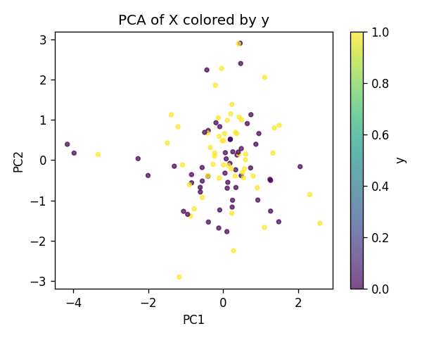
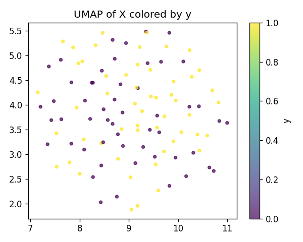
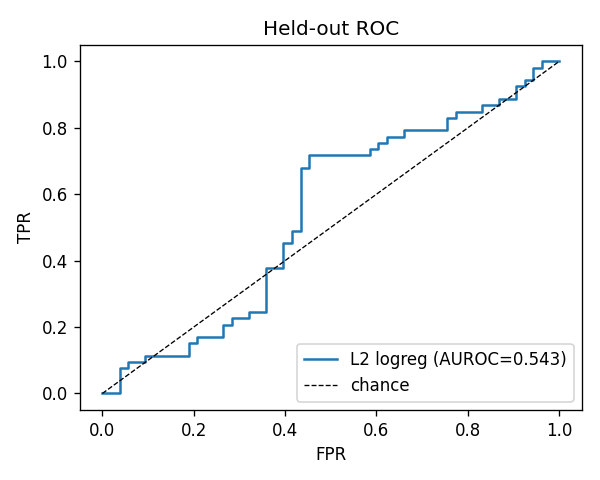
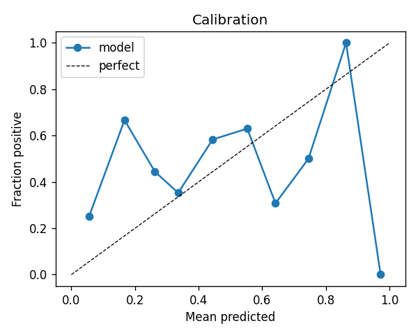
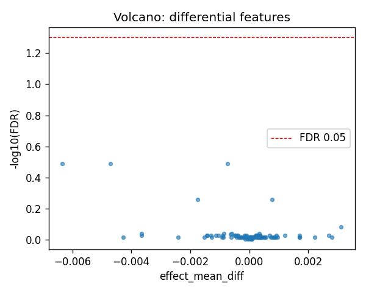
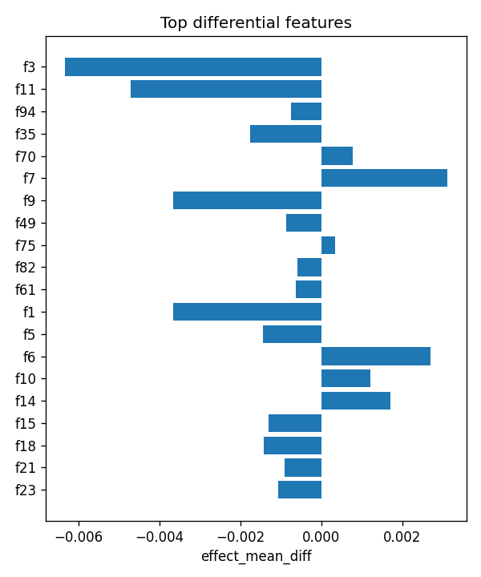

# aim1_sv :: pair_splice_vs_intergenic_lenmatched

- task: **classification**, samples: 106, features: 105, groups: 24
- split: **GroupKFold** (5 folds), seed 0

## Held-out performance (point [95% CI])

| model | auroc | auprc |
|---|---|---|
| features / l2_logreg | 0.522 [0.424, 0.627] | 0.504 [0.392, 0.668] |
| features / hist_gbt | 0.590 [0.489, 0.706] | 0.609 [0.490, 0.744] |

### Confound control

| model | auroc | auprc |
|---|---|---|
| covariates-only / l2_logreg | 0.975 [0.944, 0.997] | 0.977 [0.946, 0.997] |
| covariates-only / hist_gbt | 0.965 [0.912, 0.993] | 0.947 [0.856, 0.994] |
| features-residualized / l2_logreg | 0.044 [0.005, 0.097] | 0.316 [0.232, 0.415] |
| features-residualized / hist_gbt | 0.346 [0.229, 0.502] | 0.410 [0.299, 0.598] |

*Interpretation:* features add signal beyond the covariates only if **features-residualized** stays above chance and the raw **features** model beats **covariates-only**.

## Permutation test (label-shuffle null)

- metric: **auroc** (l2_logreg); permute within groups: True
- observed = **0.522**, null = 0.324 ± 0.084 (n=1000)
- **p-value = 0.01399**

## Differential features (BH-FDR)

- significant at FDR<0.05: **0** of 105

| feature   |   stat_mannwhitney_u |   effect_mean_diff |    p_value |   p_adj_bh | direction   |
|:----------|---------------------:|-------------------:|-----------:|-----------:|:------------|
| f3        |                  987 |       -0.00633515  | 0.00841699 |   0.323182 | down        |
| f11       |                  992 |       -0.00471728  | 0.00923378 |   0.323182 | down        |
| f94       |                  975 |       -0.000742651 | 0.0067143  |   0.323182 | down        |
| f35       |                 1052 |       -0.00175813  | 0.0261379  |   0.548895 | down        |
| f70       |                 1759 |        0.000768855 | 0.0252998  |   0.548895 | up          |
| f7        |                 1719 |        0.00311346  | 0.0472503  |   0.826881 | up          |
| f9        |                 1133 |       -0.00365793  | 0.0868325  |   0.911741 | down        |
| f49       |                 1133 |       -0.000869546 | 0.0868325  |   0.911741 | down        |
| f75       |                 1682 |        0.000344839 | 0.0800734  |   0.911741 | up          |
| f82       |                 1130 |       -0.000600546 | 0.0833975  |   0.911741 | down        |
| f61       |                 1141 |       -0.000630114 | 0.096553   |   0.921642 | down        |
| f1        |                 1236 |       -0.00365674  | 0.288449   |   0.939547 | down        |
| f5        |                 1557 |       -0.00144207  | 0.336838   |   0.939547 | down        |
| f6        |                 1556 |        0.0026907   | 0.340026   |   0.939547 | up          |
| f10       |                 1649 |        0.00121494  | 0.123135   |   0.939547 | up          |

## Plots

- 
- 
- 
- 
- 
- 
