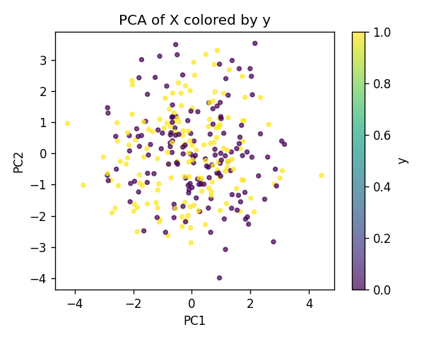
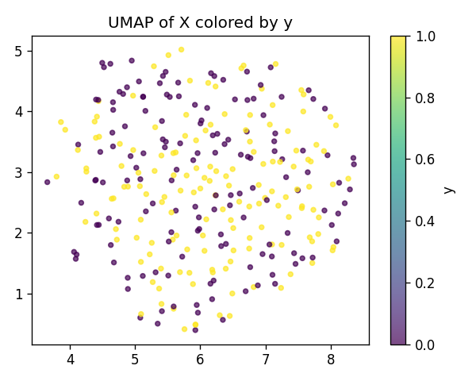
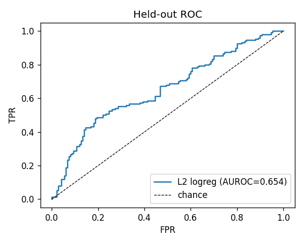
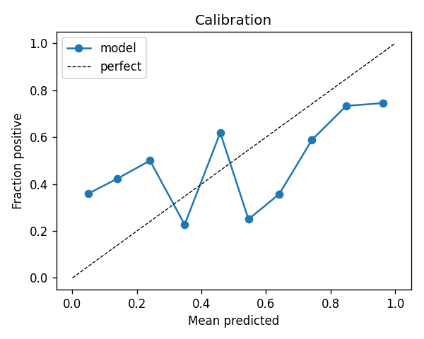
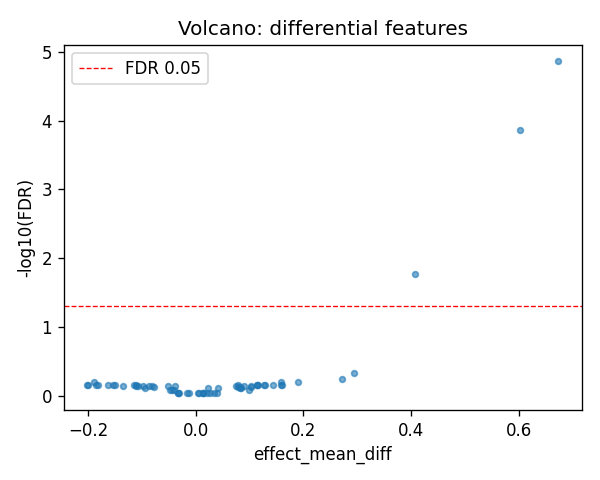
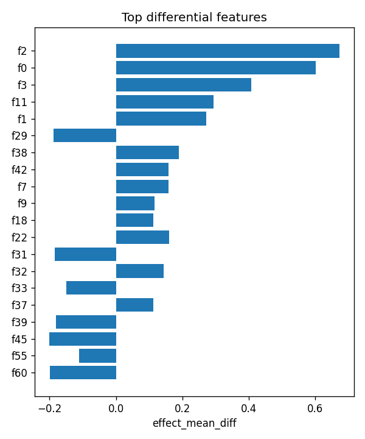

# selftest_confound

- task: **classification**, samples: 300, features: 64, groups: 10
- split: **GroupKFold** (5 folds), seed 0

## Held-out performance (point [95% CI])

| model | auroc | auprc |
|---|---|---|
| features / l2_logreg | 0.685 [0.646, 0.728] | 0.683 [0.647, 0.729] |
| features / hist_gbt | 0.596 [0.541, 0.666] | 0.602 [0.550, 0.667] |

### Confound control

| model | auroc | auprc |
|---|---|---|
| covariates-only / l2_logreg | 0.999 [0.997, 1.000] | 0.999 [0.996, 1.000] |
| covariates-only / hist_gbt | 0.982 [0.960, 1.000] | 0.978 [0.956, 1.000] |
| features-residualized / l2_logreg | 0.203 [0.149, 0.257] | 0.351 [0.309, 0.403] |
| features-residualized / hist_gbt | 0.341 [0.290, 0.395] | 0.412 [0.352, 0.485] |

*Interpretation:* features add signal beyond the covariates only if **features-residualized** stays above chance and the raw **features** model beats **covariates-only**.

## Permutation test (label-shuffle null)

- metric: **auroc** (l2_logreg); permute within groups: True
- observed = **0.685**, null = 0.426 ± 0.075 (n=200)
- **p-value = 0.004975**

## Differential features (BH-FDR)

- significant at FDR<0.05: **3** of 64

| feature   |   stat_mannwhitney_u |   effect_mean_diff |     p_value |    p_adj_bh | direction   |
|:----------|---------------------:|-------------------:|------------:|------------:|:------------|
| f2        |                15146 |           0.673692 | 2.15592e-07 | 1.37979e-05 | up          |
| f0        |                14705 |           0.602143 | 4.25866e-06 | 0.000136277 | up          |
| f3        |                13768 |           0.407562 | 0.000804953 | 0.0171723   | up          |
| f11       |                12885 |           0.294503 | 0.0295769   | 0.473231    | up          |
| f1        |                12762 |           0.272661 | 0.0442217   | 0.566038    | up          |
| f29       |                 9929 |          -0.18811  | 0.0787918   | 0.630335    | down        |
| f38       |                12626 |           0.189702 | 0.0671079   | 0.630335    | up          |
| f42       |                12585 |           0.159293 | 0.0756711   | 0.630335    | up          |
| f7        |                12323 |           0.158421 | 0.153401    | 0.692737    | up          |
| f9        |                12228 |           0.115945 | 0.193201    | 0.692737    | up          |
| f18       |                12222 |           0.112999 | 0.195949    | 0.692737    | up          |
| f22       |                12493 |           0.160265 | 0.0981453   | 0.692737    | up          |
| f31       |                10210 |          -0.184777 | 0.166452    | 0.692737    | down        |
| f32       |                12306 |           0.143313 | 0.160023    | 0.692737    | up          |
| f33       |                10102 |          -0.149294 | 0.126648    | 0.692737    | down        |

## Plots

- 
- 
- 
- 
- 
- 
