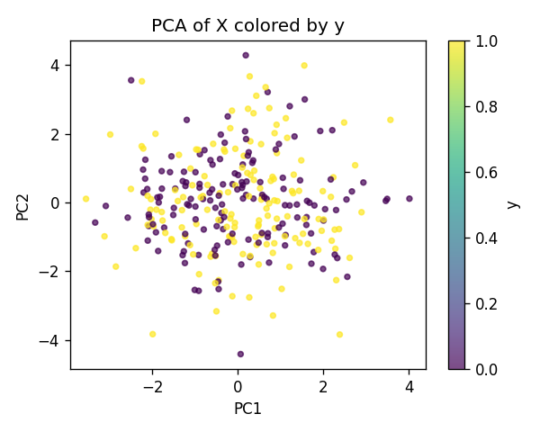
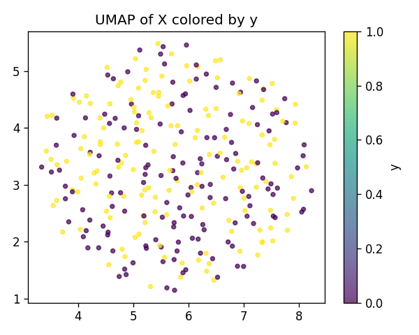
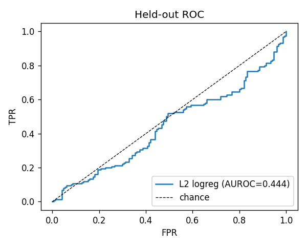
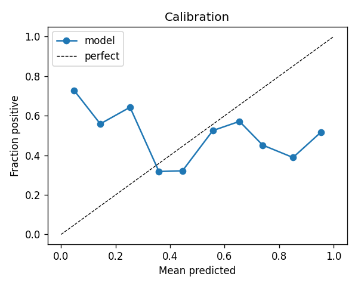
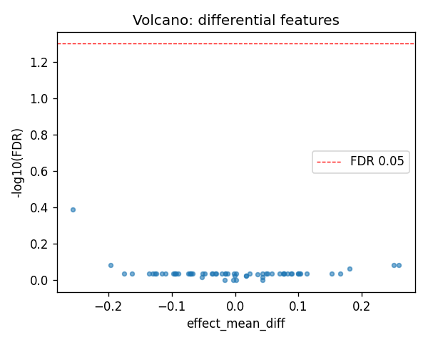
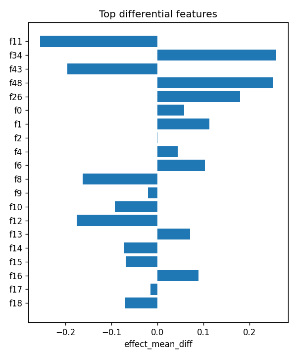

# selftest_noise

- task: **classification**, samples: 300, features: 64, groups: 10
- split: **GroupKFold** (5 folds), seed 0

## Held-out performance (point [95% CI])

| model | auroc | auprc |
|---|---|---|
| features / l2_logreg | 0.419 [0.356, 0.469] | 0.483 [0.441, 0.534] |
| features / hist_gbt | 0.461 [0.389, 0.545] | 0.487 [0.449, 0.535] |

### Confound control

| model | auroc | auprc |
|---|---|---|
| covariates-only / l2_logreg | 0.483 [0.429, 0.537] | 0.471 [0.407, 0.546] |
| covariates-only / hist_gbt | 0.412 [0.351, 0.476] | 0.448 [0.397, 0.507] |
| features-residualized / l2_logreg | 0.417 [0.352, 0.467] | 0.477 [0.436, 0.530] |
| features-residualized / hist_gbt | 0.462 [0.413, 0.519] | 0.491 [0.445, 0.535] |

*Interpretation:* features add signal beyond the covariates only if **features-residualized** stays above chance and the raw **features** model beats **covariates-only**.

## Permutation test (label-shuffle null)

- metric: **auroc** (l2_logreg); permute within groups: True
- observed = **0.419**, null = 0.456 ± 0.044 (n=200)
- **p-value = 0.806**

## Differential features (BH-FDR)

- significant at FDR<0.05: **0** of 64

| feature   |   stat_mannwhitney_u |   effect_mean_diff |    p_value |   p_adj_bh | direction   |
|:----------|---------------------:|-------------------:|-----------:|-----------:|:------------|
| f11       |                 9200 |        -0.255613   | 0.00636957 |   0.407653 | down        |
| f34       |                12714 |         0.258439   | 0.0514043  |   0.822469 | up          |
| f43       |                 9743 |        -0.196556   | 0.0449281  |   0.822469 | down        |
| f48       |                12714 |         0.250761   | 0.0514043  |   0.822469 | up          |
| f26       |                12623 |         0.180211   | 0.0677061  |   0.866639 | up          |
| f0        |                11834 |         0.0578223  | 0.437332   |   0.921224 | up          |
| f1        |                11905 |         0.113269   | 0.383636   |   0.921224 | up          |
| f2        |                11035 |        -0.00114712 | 0.775242   |   0.921224 | down        |
| f4        |                11489 |         0.0436314  | 0.750886   |   0.921224 | up          |
| f6        |                11842 |         0.10298    | 0.431074   |   0.921224 | up          |
| f8        |                10191 |        -0.162523   | 0.158839   |   0.921224 | down        |
| f9        |                11012 |        -0.0210634  | 0.751896   |   0.921224 | down        |
| f10       |                10438 |        -0.0923478  | 0.280053   |   0.921224 | down        |
| f12       |                10209 |        -0.175271   | 0.166044   |   0.921224 | down        |
| f13       |                11848 |         0.0705841  | 0.426414   |   0.921224 | up          |

## Plots

- 
- 
- 
- 
- 
- 
