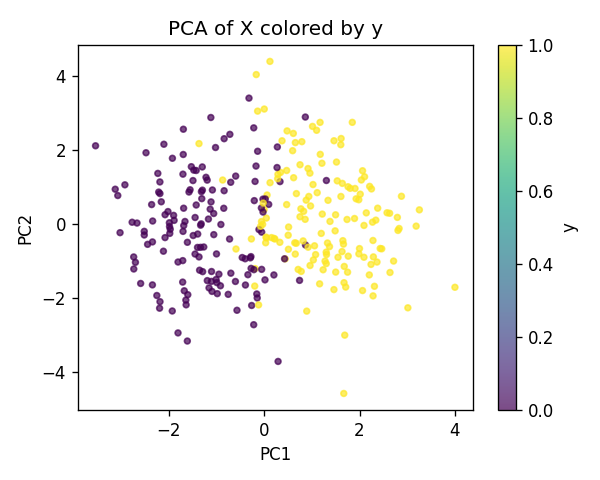
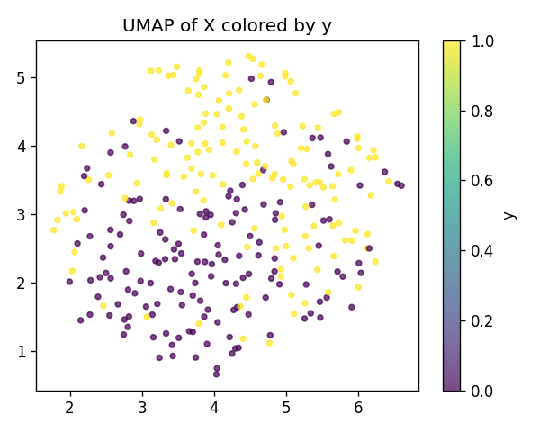
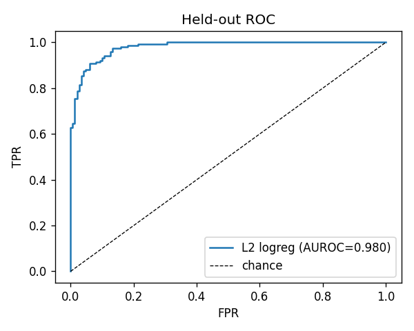
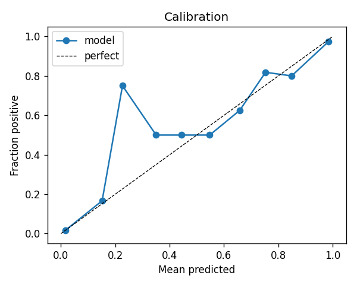
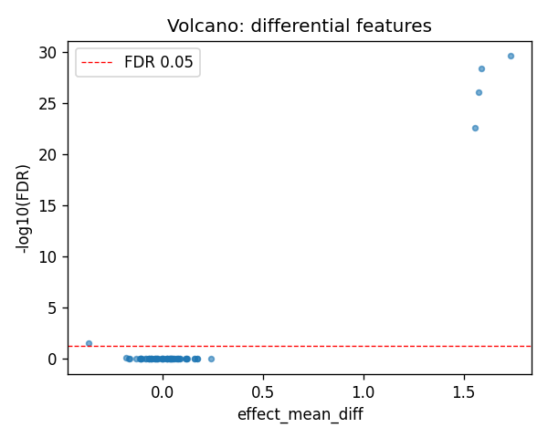
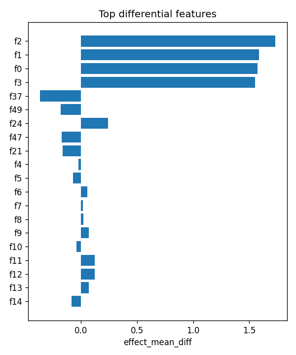

# selftest_signal

- task: **classification**, samples: 300, features: 64, groups: 10
- split: **GroupKFold** (5 folds), seed 0

## Held-out performance (point [95% CI])

| model | auroc | auprc |
|---|---|---|
| features / l2_logreg | 0.968 [0.953, 0.982] | 0.968 [0.951, 0.982] |
| features / hist_gbt | 0.972 [0.954, 0.989] | 0.970 [0.952, 0.989] |

### Confound control

| model | auroc | auprc |
|---|---|---|
| covariates-only / l2_logreg | 0.483 [0.429, 0.537] | 0.471 [0.407, 0.546] |
| covariates-only / hist_gbt | 0.412 [0.351, 0.476] | 0.448 [0.397, 0.507] |
| features-residualized / l2_logreg | 0.962 [0.946, 0.976] | 0.963 [0.944, 0.978] |
| features-residualized / hist_gbt | 0.967 [0.953, 0.981] | 0.966 [0.952, 0.984] |

*Interpretation:* features add signal beyond the covariates only if **features-residualized** stays above chance and the raw **features** model beats **covariates-only**.

## Permutation test (label-shuffle null)

- metric: **auroc** (l2_logreg); permute within groups: True
- observed = **0.968**, null = 0.469 ± 0.047 (n=200)
- **p-value = 0.004975**

## Differential features (BH-FDR)

- significant at FDR<0.05: **5** of 64

| feature   |   stat_mannwhitney_u |   effect_mean_diff |     p_value |    p_adj_bh | direction   |
|:----------|---------------------:|-------------------:|------------:|------------:|:------------|
| f2        |                20112 |          1.73327   | 4.10819e-32 | 2.62924e-30 | up          |
| f1        |                19891 |          1.58585   | 1.29622e-30 | 4.14792e-29 | up          |
| f0        |                19510 |          1.57257   | 4.06798e-28 | 8.67836e-27 | up          |
| f3        |                18931 |          1.55414   | 1.55391e-24 | 2.48626e-23 | up          |
| f37       |                 8942 |         -0.367462  | 0.00212949  | 0.0272575   | down        |
| f49       |                 9896 |         -0.181443  | 0.0715979   | 0.763711    | down        |
| f24       |                12454 |          0.241722  | 0.109156    | 0.873247    | up          |
| f47       |                10045 |         -0.171038  | 0.108862    | 0.873247    | down        |
| f21       |                10094 |         -0.164178  | 0.124023    | 0.88194     | down        |
| f4        |                11079 |         -0.0232585 | 0.820458    | 0.935152    | down        |
| f5        |                10860 |         -0.0701238 | 0.60413     | 0.935152    | down        |
| f6        |                11662 |          0.0556975 | 0.58386     | 0.935152    | up          |
| f7        |                11421 |          0.0170462 | 0.820458    | 0.935152    | up          |
| f8        |                11382 |          0.0200455 | 0.861047    | 0.935152    | up          |
| f9        |                11410 |          0.0678483 | 0.831863    | 0.935152    | up          |

## Plots

- 
- 
- 
- 
- 
- 
