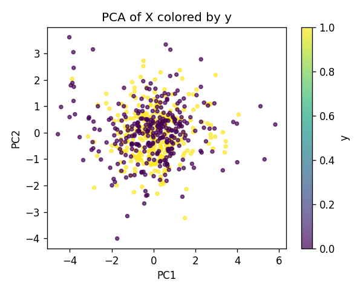
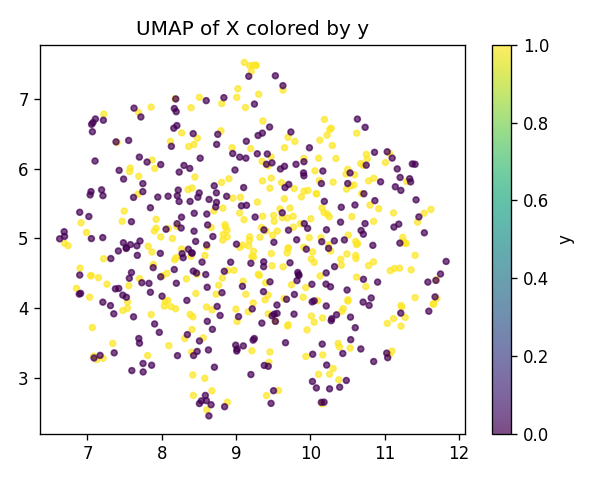
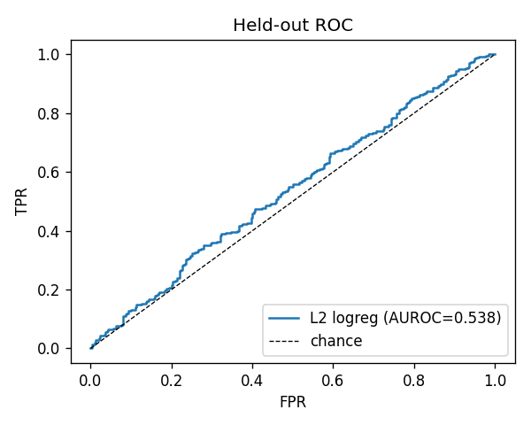
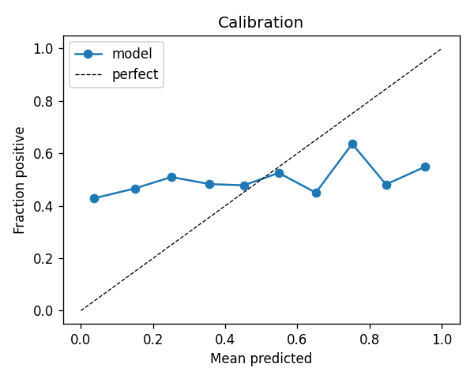
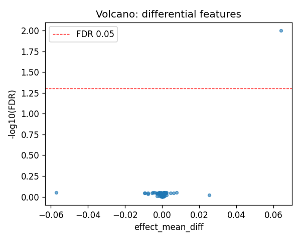
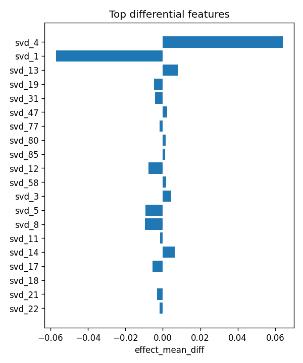

# aim2_introgression

- task: **classification**, samples: 600, features: 128, groups: 22
- split: **GroupKFold** (5 folds), seed 0

## Held-out performance (point [95% CI])

| model | auroc | auprc |
|---|---|---|
| features / l2_logreg | 0.537 [0.489, 0.592] | 0.525 [0.493, 0.582] |
| features / hist_gbt | 0.547 [0.498, 0.608] | 0.567 [0.517, 0.633] |

### Confound control

| model | auroc | auprc |
|---|---|---|
| covariates-only / l2_logreg | 0.605 [0.577, 0.643] | 0.578 [0.553, 0.621] |
| covariates-only / hist_gbt | 0.548 [0.500, 0.596] | 0.513 [0.476, 0.556] |
| features-residualized / l2_logreg | 0.494 [0.446, 0.544] | 0.475 [0.443, 0.513] |
| features-residualized / hist_gbt | 0.512 [0.468, 0.554] | 0.516 [0.483, 0.556] |

*Interpretation:* features add signal beyond the covariates only if **features-residualized** stays above chance and the raw **features** model beats **covariates-only**.

## Permutation test (label-shuffle null)

- metric: **auroc** (l2_logreg); permute within groups: True
- observed = **0.537**, null = 0.500 ± 0.031 (n=1000)
- **p-value = 0.1189**

## Differential features (BH-FDR)

- significant at FDR<0.05: **1** of 128

| feature   |   stat_mannwhitney_u |   effect_mean_diff |     p_value |   p_adj_bh | direction   |
|:----------|---------------------:|-------------------:|------------:|-----------:|:------------|
| svd_4     |                53384 |         0.06395    | 7.85667e-05 |  0.0100565 | up          |
| svd_1     |                40977 |        -0.0570355  | 0.0581392   |  0.885351  | down        |
| svd_13    |                49093 |         0.00789686 | 0.0539027   |  0.885351  | up          |
| svd_19    |                41003 |        -0.00480754 | 0.0597817   |  0.885351  | down        |
| svd_31    |                40113 |        -0.00409563 | 0.0213577   |  0.885351  | down        |
| svd_47    |                49212 |         0.00232427 | 0.0472929   |  0.885351  | up          |
| svd_77    |                40275 |        -0.00174107 | 0.0260613   |  0.885351  | down        |
| svd_80    |                48959 |         0.00156233 | 0.0622513   |  0.885351  | up          |
| svd_85    |                49044 |         0.00114032 | 0.0568402   |  0.885351  | up          |
| svd_12    |                41219 |        -0.00764596 | 0.0749678   |  0.900489  | down        |
| svd_58    |                48750 |         0.00184091 | 0.0773858   |  0.900489  | up          |
| svd_3     |                48481 |         0.00444157 | 0.101139    |  0.90389   | up          |
| svd_5     |                42307 |        -0.00931024 | 0.204726    |  0.90389   | down        |
| svd_8     |                43135 |        -0.00962929 | 0.379834    |  0.90389   | down        |
| svd_11    |                42983 |        -0.00135326 | 0.342216    |  0.90389   | down        |

## Plots

- 
- 
- 
- 
- 
- 
