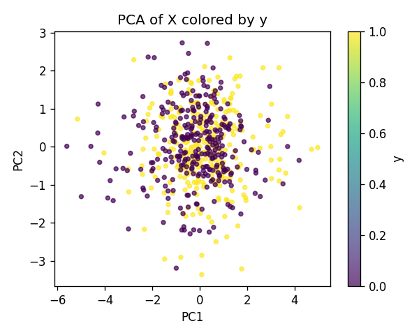
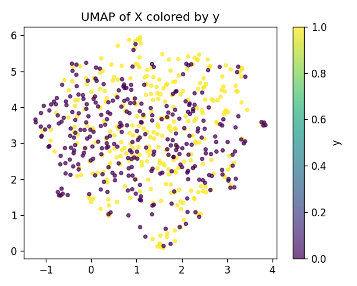
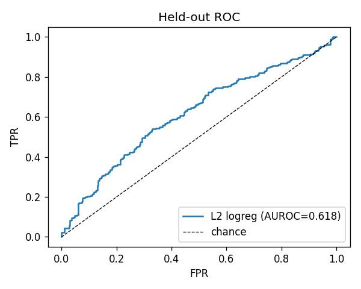
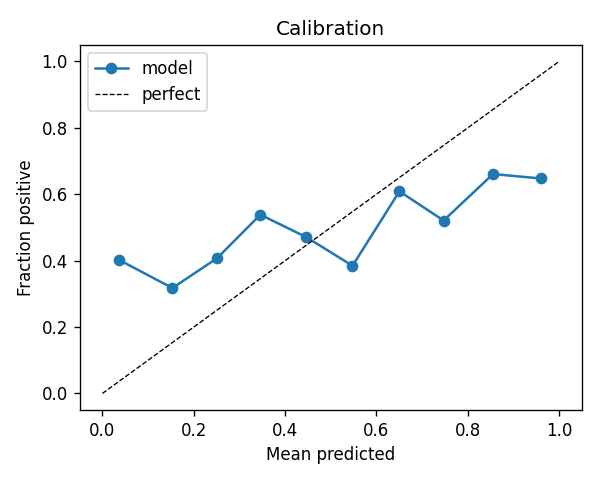
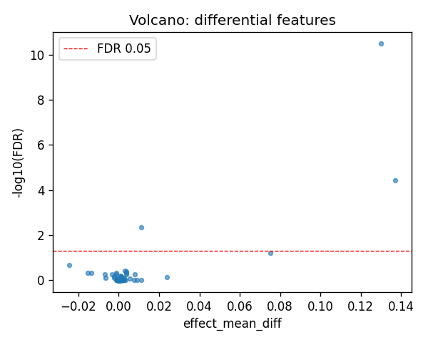
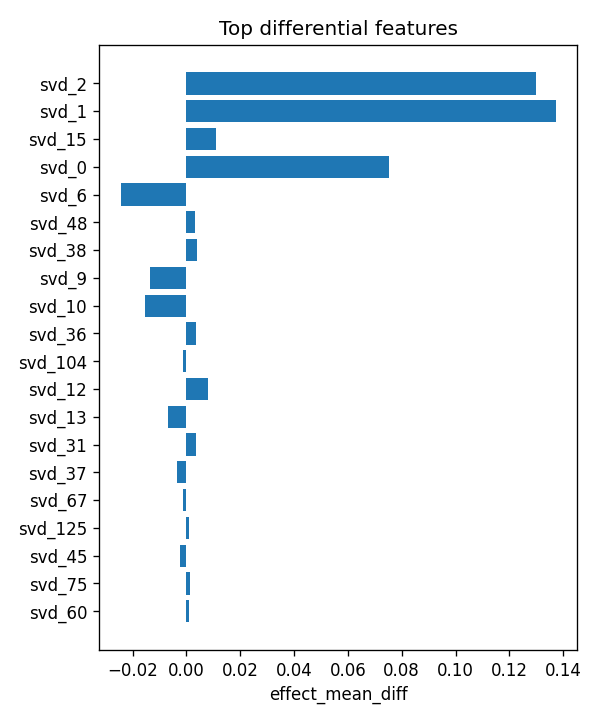

# aim2_sweeps

- task: **classification**, samples: 600, features: 128, groups: 22
- split: **GroupKFold** (5 folds), seed 0

## Held-out performance (point [95% CI])

| model | auroc | auprc |
|---|---|---|
| features / l2_logreg | 0.624 [0.580, 0.681] | 0.632 [0.588, 0.694] |
| features / hist_gbt | 0.658 [0.606, 0.728] | 0.665 [0.607, 0.732] |

### Confound control

| model | auroc | auprc |
|---|---|---|
| covariates-only / l2_logreg | 0.610 [0.577, 0.653] | 0.590 [0.563, 0.636] |
| covariates-only / hist_gbt | 0.612 [0.576, 0.656] | 0.593 [0.556, 0.655] |
| features-residualized / l2_logreg | 0.615 [0.574, 0.667] | 0.615 [0.567, 0.669] |
| features-residualized / hist_gbt | 0.642 [0.600, 0.687] | 0.656 [0.614, 0.701] |

*Interpretation:* features add signal beyond the covariates only if **features-residualized** stays above chance and the raw **features** model beats **covariates-only**.

## Permutation test (label-shuffle null)

- metric: **auroc** (l2_logreg); permute within groups: True
- observed = **0.624**, null = 0.499 ± 0.032 (n=1000)
- **p-value = 0.000999**

## Differential features (BH-FDR)

- significant at FDR<0.05: **3** of 128

| feature   |   stat_mannwhitney_u |   effect_mean_diff |     p_value |    p_adj_bh | direction   |
|:----------|---------------------:|-------------------:|------------:|------------:|:------------|
| svd_2     |                60533 |         0.129822   | 2.55478e-13 | 3.27012e-11 | up          |
| svd_1     |                55613 |         0.137165   | 5.77431e-07 | 3.69556e-05 | up          |
| svd_15    |                53238 |         0.0111023  | 0.000104472 | 0.00445749  | up          |
| svd_0     |                51596 |         0.0752562  | 0.00189277  | 0.0605688   | up          |
| svd_6     |                39416 |        -0.0245041  | 0.00854109  | 0.218652    | down        |
| svd_48    |                50013 |         0.00306893 | 0.0182283   | 0.38887     | up          |
| svd_38    |                49881 |         0.00378252 | 0.0215177   | 0.393467    | up          |
| svd_9     |                40367 |        -0.0136519  | 0.0291122   | 0.464812    | down        |
| svd_10    |                40527 |        -0.0155062  | 0.0351521   | 0.464812    | down        |
| svd_36    |                49362 |         0.00361602 | 0.0399448   | 0.464812    | up          |
| svd_104   |                40594 |        -0.00120261 | 0.0379824   | 0.464812    | down        |
| svd_12    |                49107 |         0.00793004 | 0.0530871   | 0.549796    | up          |
| svd_13    |                41135 |        -0.00697883 | 0.0687245   | 0.549796    | down        |
| svd_31    |                49051 |         0.00355788 | 0.0564126   | 0.549796    | up          |
| svd_37    |                41102 |        -0.00343715 | 0.0663917   | 0.549796    | down        |

## Plots

- 
- 
- 
- 
- 
- 
