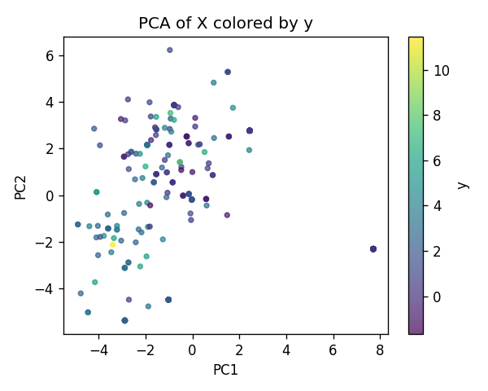
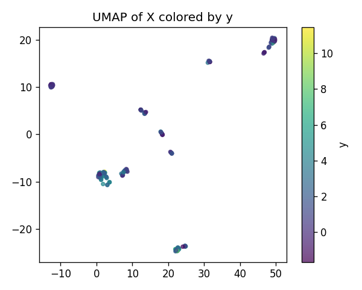
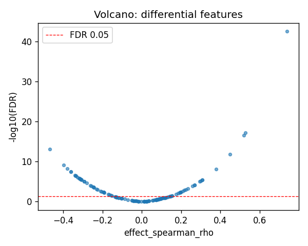
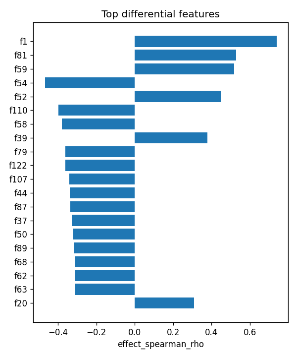

# C17orf97|ENSG00000187624 | SAE-features vs ancestry

- task: **regression**, samples: 255, features: 128, groups: 255
- split: **GroupKFold** (5 folds), seed 0

## Held-out performance (point [95% CI])

| model | spearman | r2 |
|---|---|---|
| features / ridge | 0.660 [0.588, 0.721] | 0.335 [0.196, 0.455] |
| features / hist_gbt | 0.737 [0.687, 0.780] | 0.537 [0.430, 0.632] |

### Confound control

| model | spearman | r2 |
|---|---|---|
| covariates-only / ridge | 0.051 [-0.086, 0.174] | 0.027 [-0.031, 0.081] |
| covariates-only / hist_gbt | 0.051 [-0.086, 0.174] | 0.027 [-0.031, 0.081] |
| features-residualized / ridge | 0.411 [0.280, 0.524] | -1.992 [-3.807, -0.768] |
| features-residualized / hist_gbt | 0.737 [0.689, 0.774] | 0.543 [0.452, 0.634] |

*Interpretation:* features add signal beyond the covariates only if **features-residualized** stays above chance and the raw **features** model beats **covariates-only**.

## Permutation test (label-shuffle null)

- metric: **spearman** (ridge); permute within groups: True
- observed = **0.660**, null = -0.015 ± 0.075 (n=500)
- **p-value = 0.001996**

## Differential features (BH-FDR)

- significant at FDR<0.05: **62** of 128

| feature   |   stat_spearman_rho |   effect_spearman_rho |     p_value |    p_adj_bh | direction   |
|:----------|--------------------:|----------------------:|------------:|------------:|:------------|
| f1        |            0.739186 |              0.739186 | 2.50826e-45 | 3.21057e-43 | up          |
| f81       |            0.528634 |              0.528634 | 9.26296e-20 | 5.92829e-18 | up          |
| f59       |            0.518642 |              0.518642 | 5.847e-19   | 2.49472e-17 | up          |
| f54       |           -0.468036 |             -0.468036 | 2.75491e-15 | 8.81572e-14 | down        |
| f52       |            0.448081 |              0.448081 | 5.36538e-14 | 1.37354e-12 | up          |
| f110      |           -0.398571 |             -0.398571 | 3.86163e-11 | 8.23814e-10 | down        |
| f58       |           -0.380801 |             -0.380801 | 3.18319e-10 | 5.82069e-09 | down        |
| f39       |            0.378312 |              0.378312 | 4.23462e-10 | 6.77538e-09 | up          |
| f79       |           -0.362482 |             -0.362482 | 2.46138e-09 | 3.27853e-08 | down        |
| f122      |           -0.362114 |             -0.362114 | 2.56135e-09 | 3.27853e-08 | down        |
| f107      |           -0.340904 |             -0.340904 | 2.33369e-08 | 2.71556e-07 | down        |
| f44       |           -0.337837 |             -0.337837 | 3.16917e-08 | 3.38045e-07 | down        |
| f87       |           -0.336727 |             -0.336727 | 3.53773e-08 | 3.4833e-07  | down        |
| f37       |           -0.328131 |             -0.328131 | 8.1706e-08  | 7.47026e-07 | down        |
| f50       |           -0.321157 |             -0.321157 | 1.58144e-07 | 1.34949e-06 | down        |

## Plots

- 
- 
- 
- 
