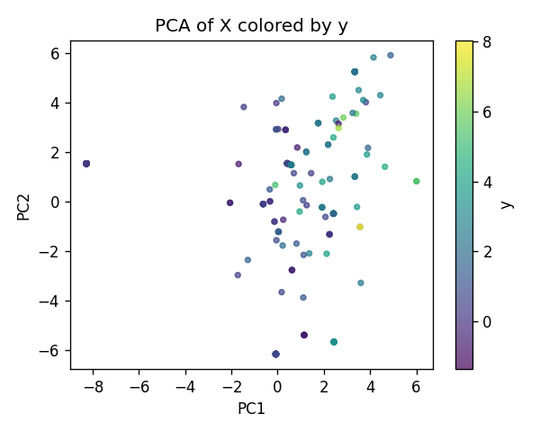
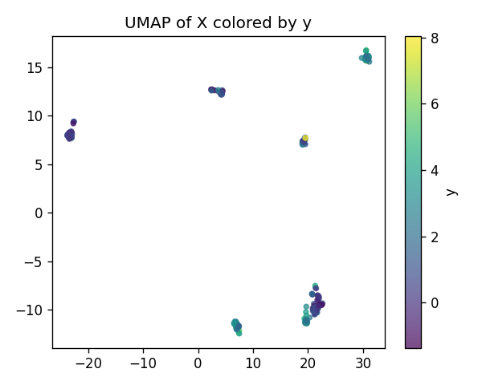
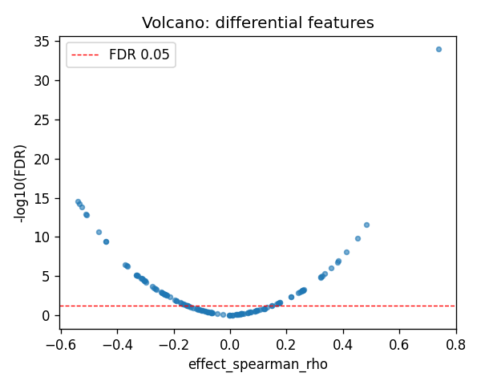
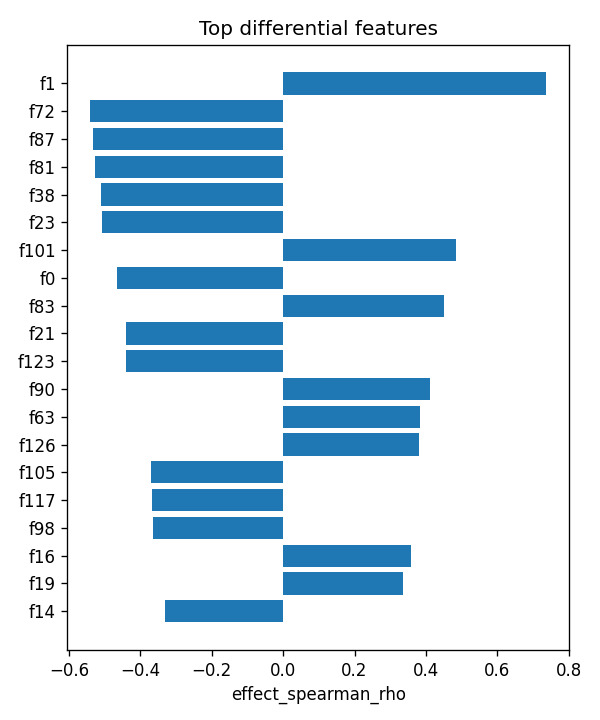

# C17orf97|ENSG00000187624 (EUR-only) | SAE-features vs ancestry

- task: **regression**, samples: 207, features: 128, groups: 207
- split: **GroupKFold** (5 folds), seed 0

## Held-out performance (point [95% CI])

| model | spearman | r2 |
|---|---|---|
| features / ridge | 0.636 [0.535, 0.714] | 0.378 [0.154, 0.554] |
| features / hist_gbt | 0.701 [0.631, 0.751] | 0.571 [0.455, 0.664] |

### Confound control

| model | spearman | r2 |
|---|---|---|
| covariates-only / ridge | -0.115 [-0.268, 0.041] | -0.008 [-0.032, -0.001] |
| covariates-only / hist_gbt | -0.115 [-0.268, 0.041] | -0.008 [-0.032, -0.001] |
| features-residualized / ridge | 0.638 [0.542, 0.718] | 0.370 [0.140, 0.558] |
| features-residualized / hist_gbt | 0.709 [0.644, 0.762] | 0.590 [0.497, 0.670] |

*Interpretation:* features add signal beyond the covariates only if **features-residualized** stays above chance and the raw **features** model beats **covariates-only**.

## Permutation test (label-shuffle null)

- metric: **spearman** (ridge); permute within groups: True
- observed = **0.636**, null = -0.022 ± 0.092 (n=500)
- **p-value = 0.001996**

## Differential features (BH-FDR)

- significant at FDR<0.05: **70** of 128

| feature   |   stat_spearman_rho |   effect_spearman_rho |     p_value |    p_adj_bh | direction   |
|:----------|--------------------:|----------------------:|------------:|------------:|:------------|
| f1        |            0.737269 |              0.737269 | 9.17127e-37 | 1.17392e-34 | up          |
| f72       |           -0.540127 |             -0.540127 | 4.4981e-17  | 2.87879e-15 | down        |
| f87       |           -0.533103 |             -0.533103 | 1.34828e-16 | 5.75264e-15 | down        |
| f81       |           -0.52582  |             -0.52582  | 4.09884e-16 | 1.31163e-14 | down        |
| f38       |           -0.50989  |             -0.50989  | 4.25874e-15 | 1.09024e-13 | down        |
| f23       |           -0.506919 |             -0.506919 | 6.50185e-15 | 1.38706e-13 | down        |
| f101      |            0.483453 |              0.483453 | 1.59905e-13 | 2.92397e-12 | up          |
| f0        |           -0.466591 |             -0.466591 | 1.37947e-12 | 2.20716e-11 | down        |
| f83       |            0.450478 |              0.450478 | 9.71277e-12 | 1.38137e-10 | up          |
| f21       |           -0.439488 |             -0.439488 | 3.47122e-11 | 4.05048e-10 | down        |
| f123      |           -0.439464 |             -0.439464 | 3.48088e-11 | 4.05048e-10 | down        |
| f90       |            0.411718 |              0.411718 | 7.12651e-10 | 7.60161e-09 | up          |
| f63       |            0.383976 |              0.383976 | 1.12011e-08 | 1.10288e-07 | up          |
| f126      |            0.379144 |              0.379144 | 1.76421e-08 | 1.613e-07   | up          |
| f105      |           -0.370686 |             -0.370686 | 3.83966e-08 | 3.27651e-07 | down        |

## Plots

- 
- 
- 
- 
