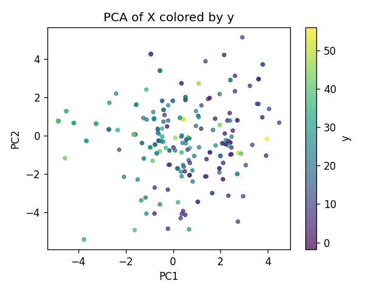
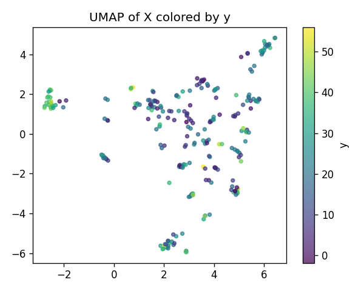
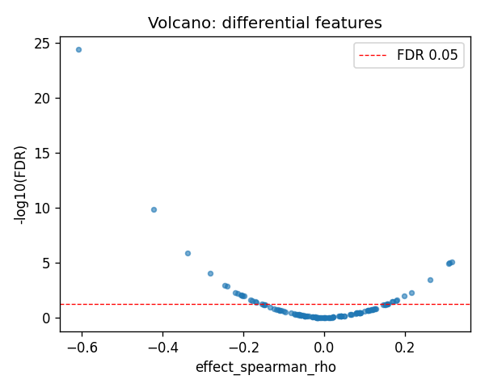
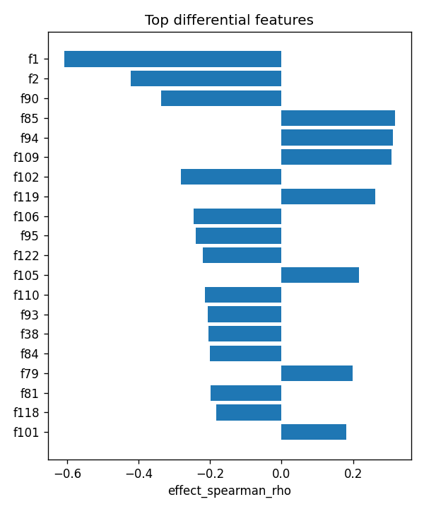

# ERAP2|ENSG00000164308 | SAE-features vs ancestry

- task: **regression**, samples: 255, features: 128, groups: 255
- split: **GroupKFold** (5 folds), seed 0

## Held-out performance (point [95% CI])

| model | spearman | r2 |
|---|---|---|
| features / ridge | 0.485 [0.374, 0.589] | -0.028 [-0.263, 0.176] |
| features / hist_gbt | 0.605 [0.512, 0.684] | 0.362 [0.200, 0.492] |

### Confound control

| model | spearman | r2 |
|---|---|---|
| covariates-only / ridge | -0.141 [-0.260, -0.013] | -0.026 [-0.055, -0.009] |
| covariates-only / hist_gbt | -0.141 [-0.260, -0.013] | -0.026 [-0.055, -0.009] |
| features-residualized / ridge | 0.490 [0.371, 0.590] | -0.130 [-0.457, 0.112] |
| features-residualized / hist_gbt | 0.570 [0.479, 0.656] | 0.336 [0.188, 0.450] |

*Interpretation:* features add signal beyond the covariates only if **features-residualized** stays above chance and the raw **features** model beats **covariates-only**.

## Permutation test (label-shuffle null)

- metric: **spearman** (ridge); permute within groups: True
- observed = **0.485**, null = -0.008 ± 0.075 (n=500)
- **p-value = 0.001996**

## Differential features (BH-FDR)

- significant at FDR<0.05: **26** of 128

| feature   |   stat_spearman_rho |   effect_spearman_rho |     p_value |    p_adj_bh | direction   |
|:----------|--------------------:|----------------------:|------------:|------------:|:------------|
| f1        |           -0.608263 |             -0.608263 | 3.39637e-27 | 4.34735e-25 | down        |
| f2        |           -0.421839 |             -0.421839 | 2.00466e-12 | 1.28298e-10 | down        |
| f90       |           -0.337842 |             -0.337842 | 3.16782e-08 | 1.3516e-06  | down        |
| f85       |            0.316732 |              0.316732 | 2.38417e-07 | 7.62935e-06 | up          |
| f94       |            0.31084  |              0.31084  | 4.07611e-07 | 1.04348e-05 | up          |
| f109      |            0.307984 |              0.307984 | 5.26441e-07 | 1.12307e-05 | up          |
| f102      |           -0.282385 |             -0.282385 | 4.63348e-06 | 8.47265e-05 | down        |
| f119      |            0.26277  |              0.26277  | 2.13367e-05 | 0.000341388 | up          |
| f106      |           -0.245459 |             -0.245459 | 7.4579e-05  | 0.00106068  | down        |
| f95       |           -0.240073 |             -0.240073 | 0.000108125 | 0.001384    | down        |
| f122      |           -0.219769 |             -0.219769 | 0.000406983 | 0.0047358   | down        |
| f105      |            0.21709  |              0.21709  | 0.000480595 | 0.00512635  | up          |
| f110      |           -0.214249 |             -0.214249 | 0.00057199  | 0.0056319   | down        |
| f93       |           -0.20701  |             -0.20701  | 0.000882478 | 0.00806837  | down        |
| f38       |           -0.204505 |             -0.204505 | 0.00102193  | 0.00872043  | down        |

## Plots

- 
- 
- 
- 
