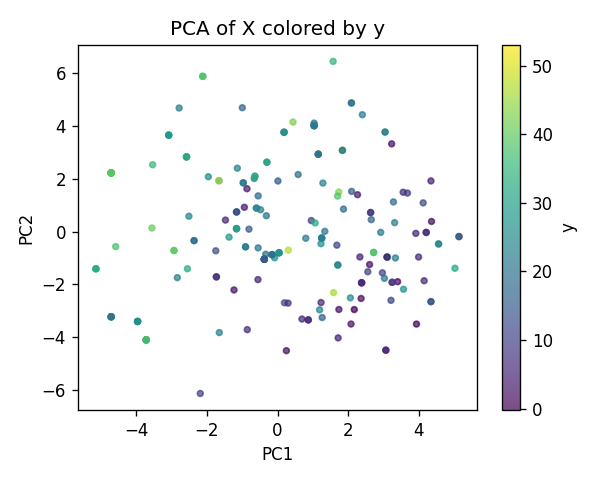
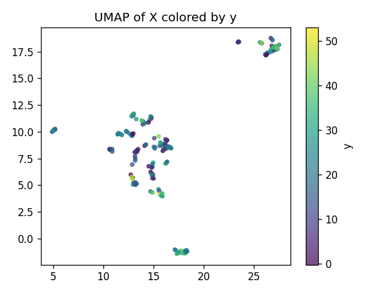
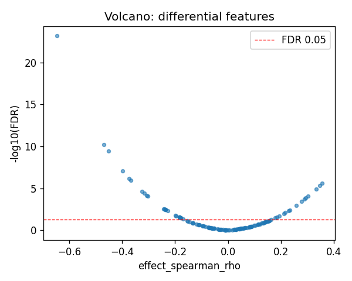
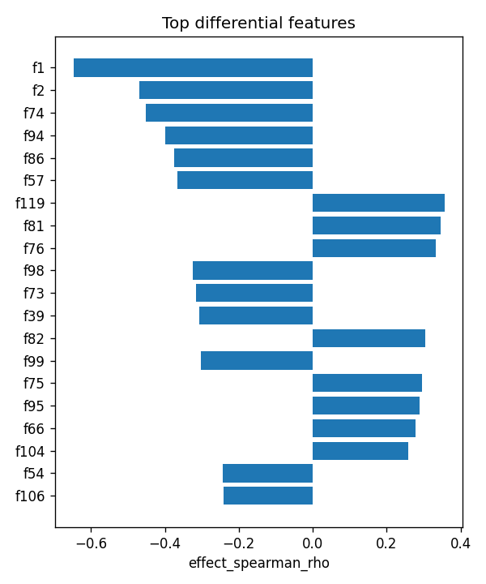

# ERAP2|ENSG00000164308 (EUR-only) | SAE-features vs ancestry

- task: **regression**, samples: 207, features: 128, groups: 207
- split: **GroupKFold** (5 folds), seed 0

## Held-out performance (point [95% CI])

| model | spearman | r2 |
|---|---|---|
| features / ridge | 0.437 [0.304, 0.550] | -0.238 [-0.565, 0.043] |
| features / hist_gbt | 0.641 [0.541, 0.717] | 0.398 [0.249, 0.522] |

### Confound control

| model | spearman | r2 |
|---|---|---|
| covariates-only / ridge | -0.115 [-0.253, 0.018] | -0.009 [-0.036, -0.004] |
| covariates-only / hist_gbt | -0.115 [-0.253, 0.018] | -0.009 [-0.036, -0.004] |
| features-residualized / ridge | 0.436 [0.305, 0.548] | -0.260 [-0.598, 0.026] |
| features-residualized / hist_gbt | 0.663 [0.570, 0.745] | 0.450 [0.316, 0.570] |

*Interpretation:* features add signal beyond the covariates only if **features-residualized** stays above chance and the raw **features** model beats **covariates-only**.

## Permutation test (label-shuffle null)

- metric: **spearman** (ridge); permute within groups: True
- observed = **0.437**, null = -0.012 ± 0.085 (n=500)
- **p-value = 0.001996**

## Differential features (BH-FDR)

- significant at FDR<0.05: **40** of 128

| feature   |   stat_spearman_rho |   effect_spearman_rho |     p_value |    p_adj_bh | direction   |
|:----------|--------------------:|----------------------:|------------:|------------:|:------------|
| f1        |           -0.647541 |             -0.647541 | 5.44176e-26 | 6.96545e-24 | down        |
| f2        |           -0.468972 |             -0.468972 | 1.02487e-12 | 6.55916e-11 | down        |
| f74       |           -0.451954 |             -0.451954 | 8.15738e-12 | 3.48048e-10 | down        |
| f94       |           -0.398625 |             -0.398625 | 2.69931e-09 | 8.63778e-08 | down        |
| f86       |           -0.374678 |             -0.374678 | 2.66742e-08 | 6.82859e-07 | down        |
| f57       |           -0.36693  |             -0.36693  | 5.38483e-08 | 1.14876e-06 | down        |
| f119      |            0.355987 |              0.355987 | 1.40786e-07 | 2.57438e-06 | up          |
| f81       |            0.346647 |              0.346647 | 3.10906e-07 | 4.97449e-06 | up          |
| f76       |            0.333612 |              0.333612 | 9.00454e-07 | 1.28065e-05 | up          |
| f98       |           -0.32547  |             -0.32547  | 1.70751e-06 | 2.18561e-05 | down        |
| f73       |           -0.315878 |             -0.315878 | 3.54477e-06 | 4.12482e-05 | down        |
| f39       |           -0.307645 |             -0.307645 | 6.50455e-06 | 6.93818e-05 | down        |
| f82       |            0.303733 |              0.303733 | 8.62463e-06 | 8.49194e-05 | up          |
| f99       |           -0.302602 |             -0.302602 | 9.3507e-06  | 8.54921e-05 | down        |
| f75       |            0.29495  |              0.29495  | 1.60133e-05 | 0.000136647 | up          |

## Plots

- 
- 
- 
- 
