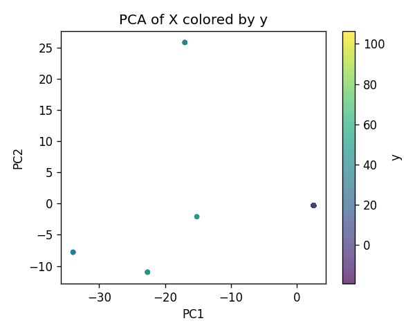
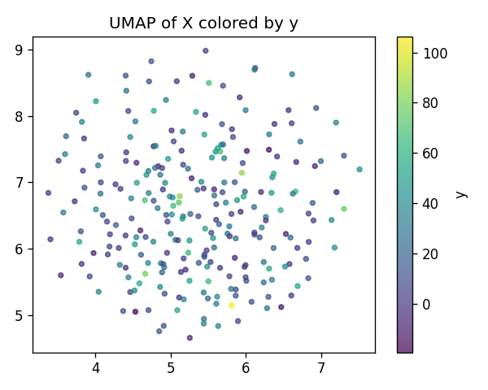
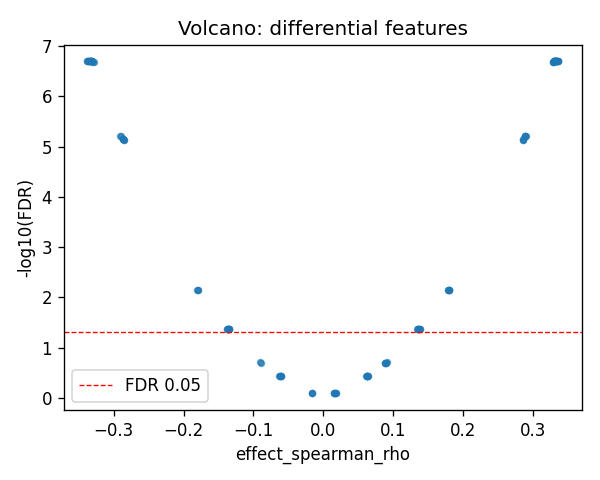
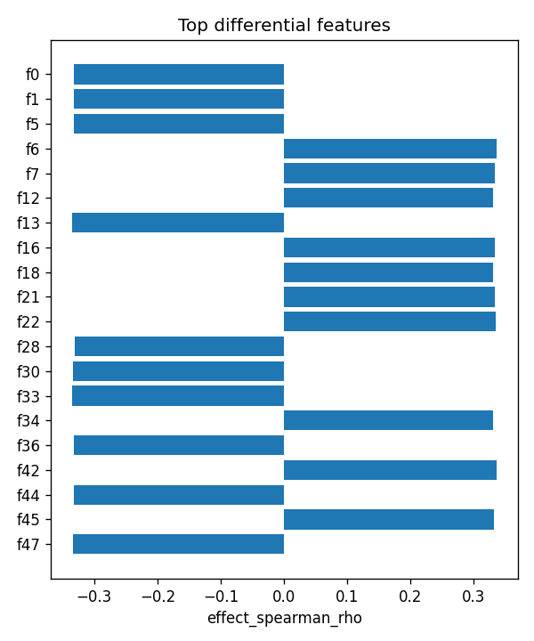

# GSTM1|ENSG00000134184 | SAE-features vs ancestry

- task: **regression**, samples: 255, features: 128, groups: 255
- split: **GroupKFold** (5 folds), seed 0

## Held-out performance (point [95% CI])

| model | spearman | r2 |
|---|---|---|
| features / ridge | 0.127 [0.016, 0.246] | 0.096 [0.020, 0.179] |
| features / hist_gbt | 0.139 [0.011, 0.268] | 0.043 [-0.007, 0.088] |

### Confound control

| model | spearman | r2 |
|---|---|---|
| covariates-only / ridge | -0.100 [-0.214, 0.033] | -0.034 [-0.070, -0.006] |
| covariates-only / hist_gbt | -0.100 [-0.214, 0.033] | -0.035 [-0.070, -0.006] |
| features-residualized / ridge | 0.208 [0.083, 0.325] | 0.104 [0.023, 0.188] |
| features-residualized / hist_gbt | 0.233 [0.118, 0.354] | 0.056 [-0.045, 0.145] |

*Interpretation:* features add signal beyond the covariates only if **features-residualized** stays above chance and the raw **features** model beats **covariates-only**.

## Permutation test (label-shuffle null)

- metric: **spearman** (ridge); permute within groups: True
- observed = **0.127**, null = -0.095 ± 0.058 (n=500)
- **p-value = 0.001996**

## Differential features (BH-FDR)

- significant at FDR<0.05: **94** of 128

| feature   |   stat_spearman_rho |   effect_spearman_rho |     p_value |    p_adj_bh | direction   |
|:----------|--------------------:|----------------------:|------------:|------------:|:------------|
| f0        |           -0.332285 |             -0.332285 | 5.46972e-08 | 2.01716e-07 | down        |
| f1        |           -0.332285 |             -0.332285 | 5.46972e-08 | 2.01716e-07 | down        |
| f5        |           -0.332089 |             -0.332089 | 5.57524e-08 | 2.01716e-07 | down        |
| f6        |            0.336233 |              0.336233 | 3.71477e-08 | 2.01716e-07 | up          |
| f7        |            0.333395 |              0.333395 | 4.90875e-08 | 2.01716e-07 | up          |
| f12       |            0.330967 |              0.330967 | 6.21686e-08 | 2.01716e-07 | up          |
| f13       |           -0.335103 |             -0.335103 | 4.15186e-08 | 2.01716e-07 | down        |
| f16       |            0.333414 |              0.333414 | 4.89934e-08 | 2.01716e-07 | up          |
| f18       |            0.329837 |              0.329837 | 6.93398e-08 | 2.01716e-07 | up          |
| f21       |            0.332656 |              0.332656 | 5.27596e-08 | 2.01716e-07 | up          |
| f22       |            0.334534 |              0.334534 | 4.39071e-08 | 2.01716e-07 | up          |
| f28       |           -0.330967 |             -0.330967 | 6.21686e-08 | 2.01716e-07 | down        |
| f30       |           -0.333414 |             -0.333414 | 4.89934e-08 | 2.01716e-07 | down        |
| f33       |           -0.335103 |             -0.335103 | 4.15186e-08 | 2.01716e-07 | down        |
| f34       |            0.329857 |              0.329857 | 6.92085e-08 | 2.01716e-07 | up          |

## Plots

- 
- 
- 
- 
