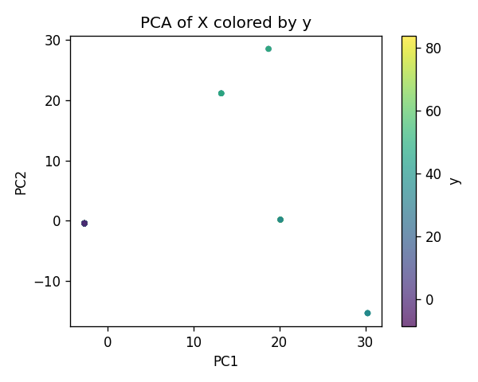
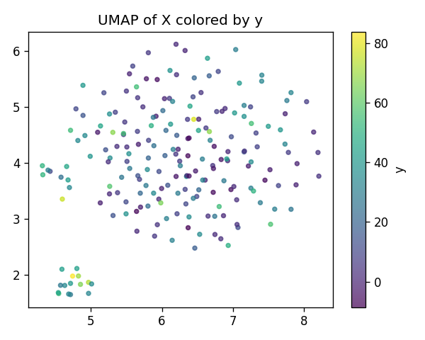
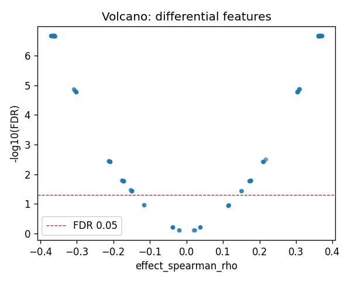
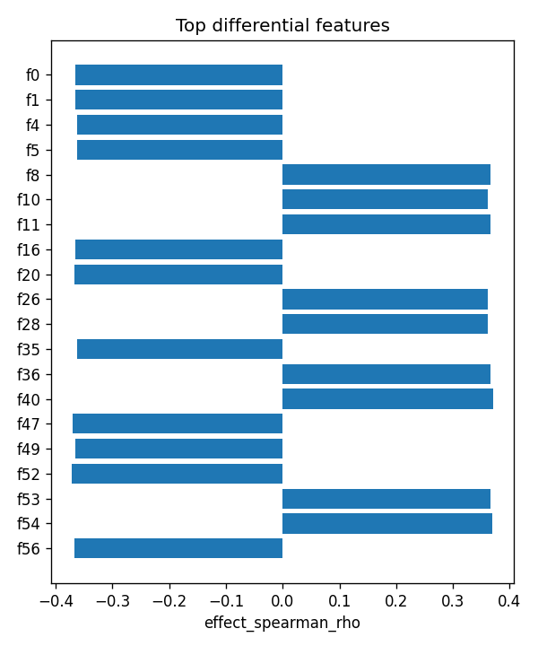

# GSTM1|ENSG00000134184 (EUR-only) | SAE-features vs ancestry

- task: **regression**, samples: 207, features: 128, groups: 207
- split: **GroupKFold** (5 folds), seed 0

## Held-out performance (point [95% CI])

| model | spearman | r2 |
|---|---|---|
| features / ridge | 0.048 [-0.080, 0.171] | 0.122 [0.012, 0.220] |
| features / hist_gbt | -0.111 [-0.247, 0.002] | -0.026 [-0.072, 0.008] |

### Confound control

| model | spearman | r2 |
|---|---|---|
| covariates-only / ridge | -0.163 [-0.292, -0.029] | -0.021 [-0.045, -0.009] |
| covariates-only / hist_gbt | -0.163 [-0.292, -0.029] | -0.021 [-0.045, -0.009] |
| features-residualized / ridge | 0.068 [-0.070, 0.198] | 0.125 [0.014, 0.222] |
| features-residualized / hist_gbt | 0.160 [0.018, 0.280] | -0.116 [-0.303, 0.019] |

*Interpretation:* features add signal beyond the covariates only if **features-residualized** stays above chance and the raw **features** model beats **covariates-only**.

## Permutation test (label-shuffle null)

- metric: **spearman** (ridge); permute within groups: True
- observed = **0.048**, null = -0.104 ± 0.062 (n=500)
- **p-value = 0.007984**

## Differential features (BH-FDR)

- significant at FDR<0.05: **111** of 128

| feature   |   stat_spearman_rho |   effect_spearman_rho |     p_value |    p_adj_bh | direction   |
|:----------|--------------------:|----------------------:|------------:|------------:|:------------|
| f0        |           -0.365853 |             -0.365853 | 5.9287e-08  | 2.15383e-07 | down        |
| f1        |           -0.365853 |             -0.365853 | 5.9287e-08  | 2.15383e-07 | down        |
| f4        |           -0.362616 |             -0.362616 | 7.89929e-08 | 2.15383e-07 | down        |
| f5        |           -0.36184  |             -0.36184  | 8.45815e-08 | 2.15383e-07 | down        |
| f8        |            0.366669 |              0.366669 | 5.51216e-08 | 2.15383e-07 | up          |
| f10       |            0.361024 |              0.361024 | 9.08649e-08 | 2.15383e-07 | up          |
| f11       |            0.365853 |              0.365853 | 5.9287e-08  | 2.15383e-07 | up          |
| f16       |           -0.365853 |             -0.365853 | 5.9287e-08  | 2.15383e-07 | down        |
| f20       |           -0.366669 |             -0.366669 | 5.51216e-08 | 2.15383e-07 | down        |
| f26       |            0.362006 |              0.362006 | 8.33542e-08 | 2.15383e-07 | up          |
| f28       |            0.36184  |              0.36184  | 8.45815e-08 | 2.15383e-07 | up          |
| f35       |           -0.362616 |             -0.362616 | 7.89929e-08 | 2.15383e-07 | down        |
| f36       |            0.366426 |              0.366426 | 5.6332e-08  | 2.15383e-07 | up          |
| f40       |            0.370582 |              0.370582 | 3.87571e-08 | 2.15383e-07 | up          |
| f47       |           -0.369766 |             -0.369766 | 4.17266e-08 | 2.15383e-07 | down        |

## Plots

- 
- 
- 
- 
