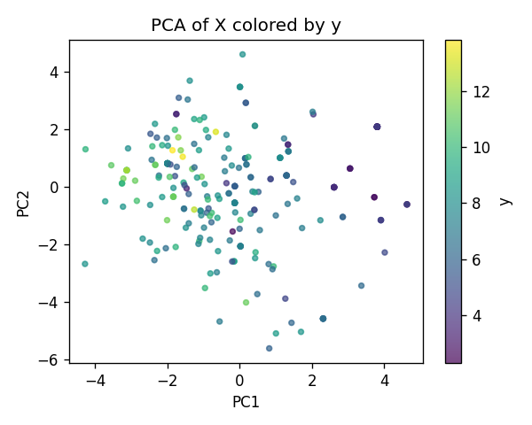
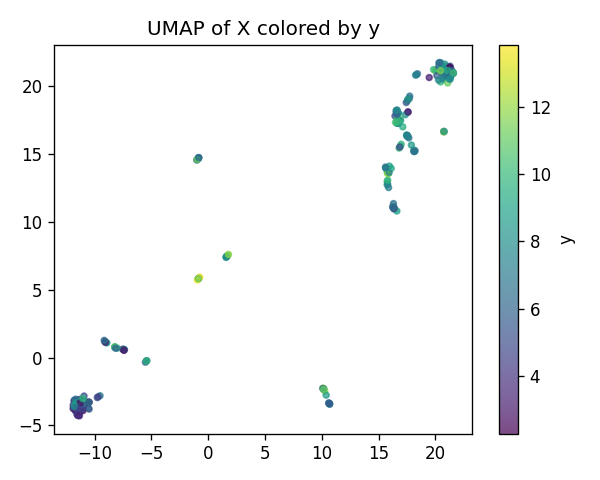
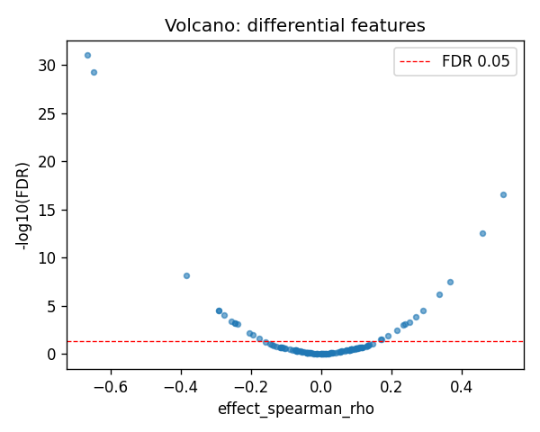
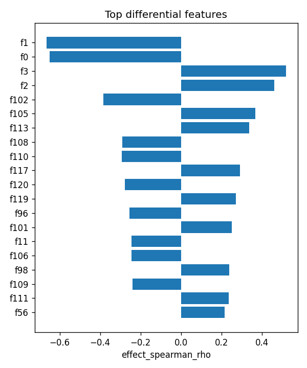

# PEX6|ENSG00000124587 | SAE-features vs ancestry

- task: **regression**, samples: 255, features: 128, groups: 255
- split: **GroupKFold** (5 folds), seed 0

## Held-out performance (point [95% CI])

| model | spearman | r2 |
|---|---|---|
| features / ridge | 0.632 [0.527, 0.716] | 0.312 [0.112, 0.459] |
| features / hist_gbt | 0.795 [0.727, 0.850] | 0.718 [0.651, 0.765] |

### Confound control

| model | spearman | r2 |
|---|---|---|
| covariates-only / ridge | -0.135 [-0.251, -0.010] | -0.009 [-0.027, -0.003] |
| covariates-only / hist_gbt | -0.135 [-0.251, -0.010] | -0.009 [-0.027, -0.003] |
| features-residualized / ridge | 0.631 [0.525, 0.712] | 0.293 [0.092, 0.444] |
| features-residualized / hist_gbt | 0.802 [0.745, 0.851] | 0.702 [0.633, 0.753] |

*Interpretation:* features add signal beyond the covariates only if **features-residualized** stays above chance and the raw **features** model beats **covariates-only**.

## Permutation test (label-shuffle null)

- metric: **spearman** (ridge); permute within groups: True
- observed = **0.632**, null = -0.013 ± 0.079 (n=500)
- **p-value = 0.001996**

## Differential features (BH-FDR)

- significant at FDR<0.05: **26** of 128

| feature   |   stat_spearman_rho |   effect_spearman_rho |     p_value |    p_adj_bh | direction   |
|:----------|--------------------:|----------------------:|------------:|------------:|:------------|
| f1        |           -0.664514 |             -0.664514 | 7.34544e-34 | 9.40216e-32 | down        |
| f0        |           -0.648182 |             -0.648182 | 8.83765e-32 | 5.6561e-30  | down        |
| f3        |            0.518179 |              0.518179 | 6.35828e-19 | 2.71287e-17 | up          |
| f2        |            0.46059  |              0.46059  | 8.53303e-15 | 2.73057e-13 | up          |
| f102      |           -0.382614 |             -0.382614 | 2.58136e-10 | 6.60827e-09 | down        |
| f105      |            0.366887 |              0.366887 | 1.52277e-09 | 3.24858e-08 | up          |
| f113      |            0.3359   |              0.3359   | 3.83882e-08 | 7.01955e-07 | up          |
| f108      |           -0.291393 |             -0.291393 | 2.20749e-06 | 3.0388e-05  | down        |
| f110      |           -0.292188 |             -0.292188 | 2.06525e-06 | 3.0388e-05  | down        |
| f117      |            0.290523 |              0.290523 | 2.37407e-06 | 3.0388e-05  | up          |
| f120      |           -0.27702  |             -0.27702  | 7.11898e-06 | 8.2839e-05  | down        |
| f119      |            0.270252 |              0.270252 | 1.20832e-05 | 0.000128888 | up          |
| f96       |           -0.254983 |             -0.254983 | 3.78784e-05 | 0.000372957 | down        |
| f101      |            0.250865 |              0.250865 | 5.09358e-05 | 0.000465699 | up          |
| f11       |           -0.243959 |             -0.243959 | 8.27794e-05 | 0.000662235 | down        |

## Plots

- 
- 
- 
- 
