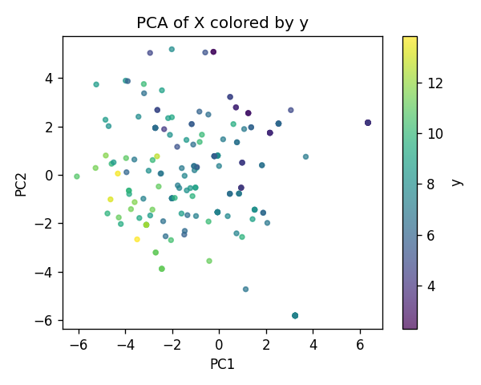
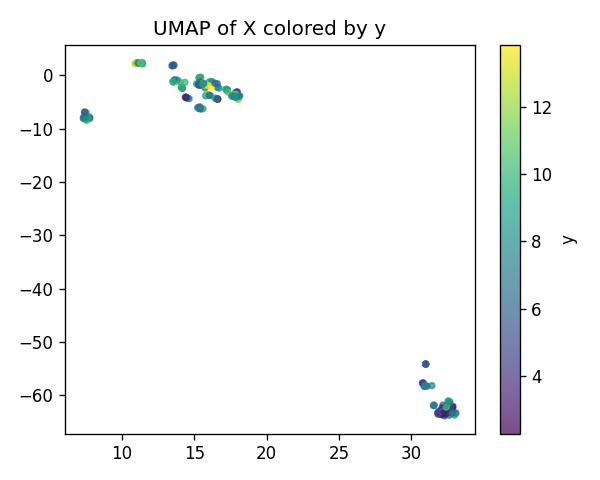
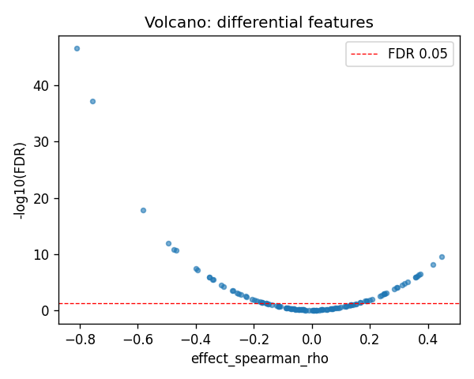
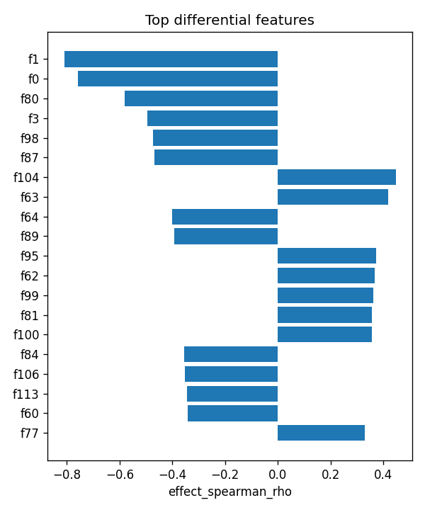

# PEX6|ENSG00000124587 (EUR-only) | SAE-features vs ancestry

- task: **regression**, samples: 207, features: 128, groups: 207
- split: **GroupKFold** (5 folds), seed 0

## Held-out performance (point [95% CI])

| model | spearman | r2 |
|---|---|---|
| features / ridge | 0.773 [0.702, 0.836] | 0.570 [0.411, 0.684] |
| features / hist_gbt | 0.815 [0.737, 0.870] | 0.702 [0.603, 0.781] |

### Confound control

| model | spearman | r2 |
|---|---|---|
| covariates-only / ridge | -0.164 [-0.292, -0.032] | -0.017 [-0.044, -0.007] |
| covariates-only / hist_gbt | -0.164 [-0.292, -0.032] | -0.017 [-0.044, -0.007] |
| features-residualized / ridge | 0.773 [0.703, 0.837] | 0.557 [0.386, 0.676] |
| features-residualized / hist_gbt | 0.822 [0.748, 0.879] | 0.711 [0.611, 0.788] |

*Interpretation:* features add signal beyond the covariates only if **features-residualized** stays above chance and the raw **features** model beats **covariates-only**.

## Permutation test (label-shuffle null)

- metric: **spearman** (ridge); permute within groups: True
- observed = **0.773**, null = -0.013 ± 0.083 (n=500)
- **p-value = 0.001996**

## Differential features (BH-FDR)

- significant at FDR<0.05: **54** of 128

| feature   |   stat_spearman_rho |   effect_spearman_rho |     p_value |    p_adj_bh | direction   |
|:----------|--------------------:|----------------------:|------------:|------------:|:------------|
| f1        |           -0.809621 |             -0.809621 | 2.51108e-49 | 3.21418e-47 | down        |
| f0        |           -0.757052 |             -0.757052 | 9.34091e-40 | 5.97818e-38 | down        |
| f80       |           -0.582152 |             -0.582152 | 3.5797e-20  | 1.52734e-18 | down        |
| f3        |           -0.494303 |             -0.494303 | 3.74995e-14 | 1.19999e-12 | down        |
| f98       |           -0.474449 |             -0.474449 | 5.12806e-13 | 1.31278e-11 | down        |
| f87       |           -0.468479 |             -0.468479 | 1.09006e-12 | 2.32546e-11 | down        |
| f104      |            0.447307 |              0.447307 | 1.40921e-11 | 2.57685e-10 | up          |
| f63       |            0.418237 |              0.418237 | 3.59304e-10 | 5.74886e-09 | up          |
| f64       |           -0.399469 |             -0.399469 | 2.48157e-09 | 3.52934e-08 | down        |
| f89       |           -0.392669 |             -0.392669 | 4.85489e-09 | 6.21425e-08 | down        |
| f95       |            0.372926 |              0.372926 | 3.13177e-08 | 3.64424e-07 | up          |
| f62       |            0.368839 |              0.368839 | 4.5367e-08  | 4.83915e-07 | up          |
| f99       |            0.362337 |              0.362337 | 8.09596e-08 | 7.9714e-07  | up          |
| f81       |            0.357757 |              0.357757 | 1.20808e-07 | 1.03089e-06 | up          |
| f100      |            0.358023 |              0.358023 | 1.18058e-07 | 1.03089e-06 | up          |

## Plots

- 
- 
- 
- 
