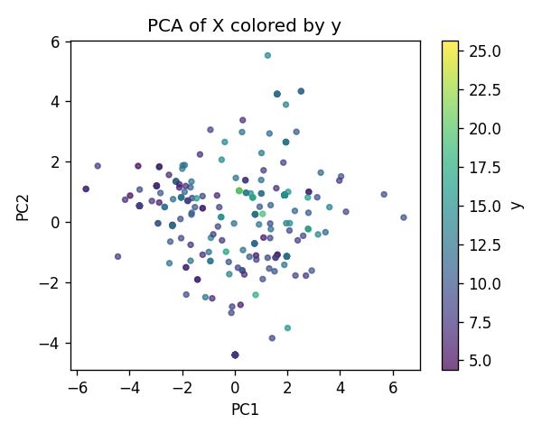
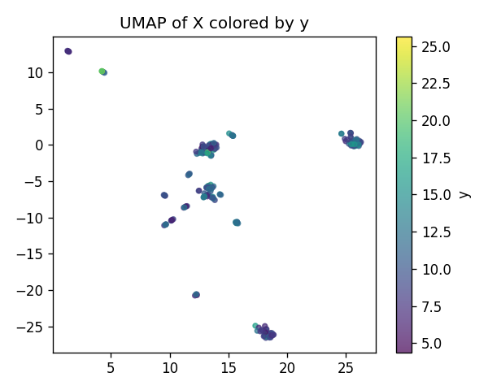
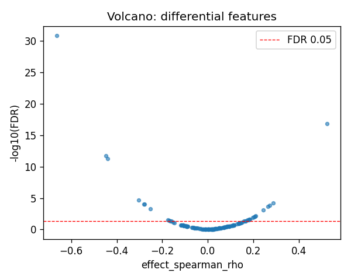
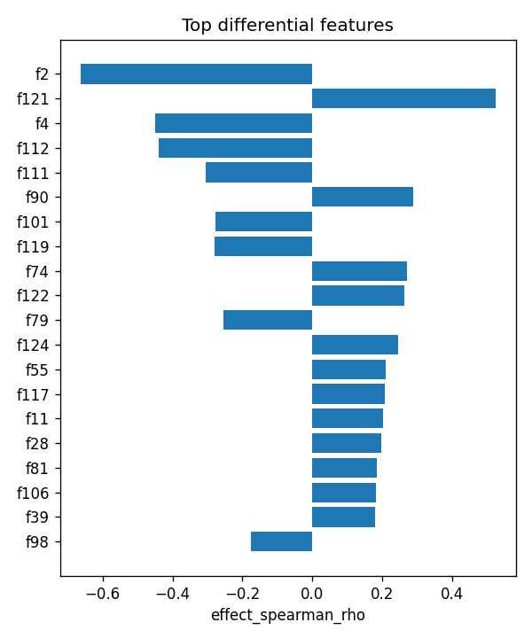

# POMZP3|ENSG00000146707 | SAE-features vs ancestry

- task: **regression**, samples: 255, features: 128, groups: 255
- split: **GroupKFold** (5 folds), seed 0

## Held-out performance (point [95% CI])

| model | spearman | r2 |
|---|---|---|
| features / ridge | 0.630 [0.541, 0.706] | 0.276 [0.100, 0.423] |
| features / hist_gbt | 0.754 [0.700, 0.802] | 0.587 [0.505, 0.658] |

### Confound control

| model | spearman | r2 |
|---|---|---|
| covariates-only / ridge | -0.048 [-0.171, 0.075] | -0.007 [-0.036, 0.007] |
| covariates-only / hist_gbt | -0.048 [-0.171, 0.075] | -0.007 [-0.036, 0.007] |
| features-residualized / ridge | 0.618 [0.535, 0.693] | 0.118 [-0.167, 0.345] |
| features-residualized / hist_gbt | 0.767 [0.716, 0.808] | 0.611 [0.543, 0.671] |

*Interpretation:* features add signal beyond the covariates only if **features-residualized** stays above chance and the raw **features** model beats **covariates-only**.

## Permutation test (label-shuffle null)

- metric: **spearman** (ridge); permute within groups: True
- observed = **0.630**, null = -0.011 ± 0.078 (n=500)
- **p-value = 0.001996**

## Differential features (BH-FDR)

- significant at FDR<0.05: **26** of 128

| feature   |   stat_spearman_rho |   effect_spearman_rho |     p_value |    p_adj_bh | direction   |
|:----------|--------------------:|----------------------:|------------:|------------:|:------------|
| f2        |           -0.662854 |             -0.662854 | 1.21181e-33 | 1.55111e-31 | down        |
| f121      |            0.523916 |              0.523916 | 2.22781e-19 | 1.4258e-17  | up          |
| f4        |           -0.448908 |             -0.448908 | 4.76201e-14 | 2.03179e-12 | down        |
| f112      |           -0.439314 |             -0.439314 | 1.86226e-13 | 5.95923e-12 | down        |
| f111      |           -0.304076 |             -0.304076 | 7.43842e-07 | 1.90424e-05 | down        |
| f90       |            0.287878 |              0.287878 | 2.95723e-06 | 6.30876e-05 | up          |
| f101      |           -0.278219 |             -0.278219 | 6.47228e-06 | 0.000103557 | down        |
| f119      |           -0.279793 |             -0.279793 | 5.70817e-06 | 0.000103557 | down        |
| f74       |            0.272113 |              0.272113 | 1.04616e-05 | 0.000148788 | up          |
| f122      |            0.264438 |              0.264438 | 1.8825e-05  | 0.000240959 | up          |
| f79       |           -0.253156 |             -0.253156 | 4.32263e-05 | 0.000502998 | down        |
| f124      |            0.244819 |              0.244819 | 7.79823e-05 | 0.000831812 | up          |
| f55       |            0.210464 |              0.210464 | 0.000718848 | 0.00707789  | up          |
| f117      |            0.20661  |              0.20661  | 0.000903481 | 0.0082604   | up          |
| f11       |            0.202652 |              0.202652 | 0.00113784  | 0.00970953  | up          |

## Plots

- 
- 
- 
- 
