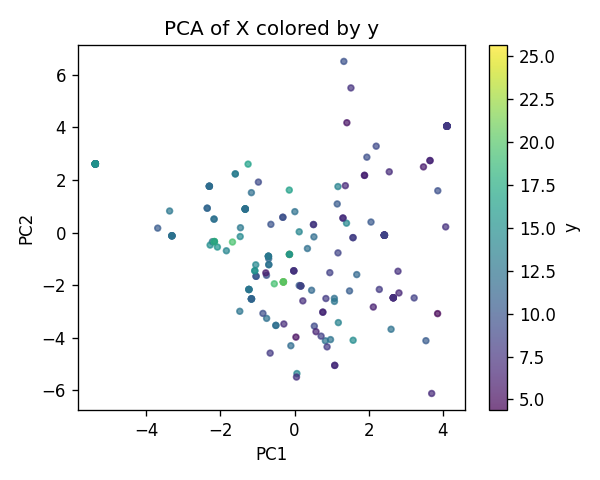
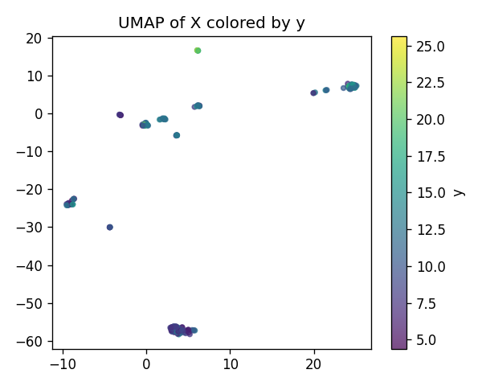
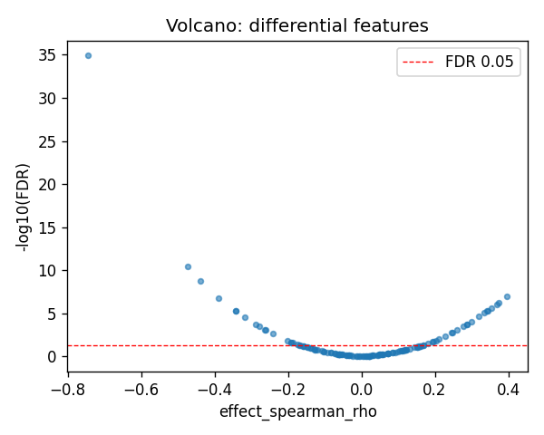
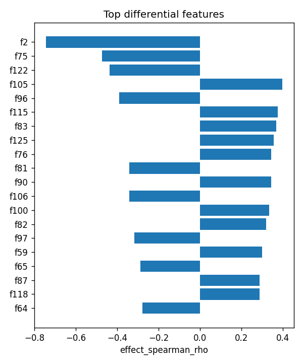

# POMZP3|ENSG00000146707 (EUR-only) | SAE-features vs ancestry

- task: **regression**, samples: 207, features: 128, groups: 207
- split: **GroupKFold** (5 folds), seed 0

## Held-out performance (point [95% CI])

| model | spearman | r2 |
|---|---|---|
| features / ridge | 0.642 [0.546, 0.728] | 0.348 [0.147, 0.503] |
| features / hist_gbt | 0.763 [0.708, 0.807] | 0.602 [0.506, 0.684] |

### Confound control

| model | spearman | r2 |
|---|---|---|
| covariates-only / ridge | -0.106 [-0.229, 0.029] | -0.007 [-0.036, -0.002] |
| covariates-only / hist_gbt | -0.106 [-0.229, 0.029] | -0.007 [-0.036, -0.002] |
| features-residualized / ridge | 0.647 [0.547, 0.732] | 0.343 [0.139, 0.497] |
| features-residualized / hist_gbt | 0.782 [0.736, 0.823] | 0.623 [0.534, 0.688] |

*Interpretation:* features add signal beyond the covariates only if **features-residualized** stays above chance and the raw **features** model beats **covariates-only**.

## Permutation test (label-shuffle null)

- metric: **spearman** (ridge); permute within groups: True
- observed = **0.642**, null = -0.016 ± 0.087 (n=500)
- **p-value = 0.001996**

## Differential features (BH-FDR)

- significant at FDR<0.05: **42** of 128

| feature   |   stat_spearman_rho |   effect_spearman_rho |     p_value |    p_adj_bh | direction   |
|:----------|--------------------:|----------------------:|------------:|------------:|:------------|
| f2        |           -0.743875 |             -0.743875 | 9.86347e-38 | 1.26252e-35 | down        |
| f75       |           -0.473395 |             -0.473395 | 5.86443e-13 | 3.75324e-11 | down        |
| f122      |           -0.437794 |             -0.437794 | 4.20764e-11 | 1.79526e-09 | down        |
| f105      |            0.396073 |              0.396073 | 3.47634e-09 | 1.11243e-07 | up          |
| f96       |           -0.389357 |             -0.389357 | 6.69546e-09 | 1.71404e-07 | down        |
| f115      |            0.374835 |              0.374835 | 2.62912e-08 | 5.60878e-07 | up          |
| f83       |            0.367879 |              0.367879 | 4.94557e-08 | 9.04333e-07 | up          |
| f125      |            0.354352 |              0.354352 | 1.62027e-07 | 2.59244e-06 | up          |
| f76       |            0.343481 |              0.343481 | 4.04308e-07 | 4.80813e-06 | up          |
| f81       |           -0.342797 |             -0.342797 | 4.27765e-07 | 4.80813e-06 | down        |
| f90       |            0.342161 |              0.342161 | 4.50762e-07 | 4.80813e-06 | up          |
| f106      |           -0.342761 |             -0.342761 | 4.29055e-07 | 4.80813e-06 | down        |
| f100      |            0.334632 |              0.334632 | 8.30007e-07 | 8.17238e-06 | up          |
| f82       |            0.320011 |              0.320011 | 2.59551e-06 | 2.37304e-05 | up          |
| f97       |           -0.317462 |             -0.317462 | 3.14736e-06 | 2.68575e-05 | down        |

## Plots

- 
- 
- 
- 
