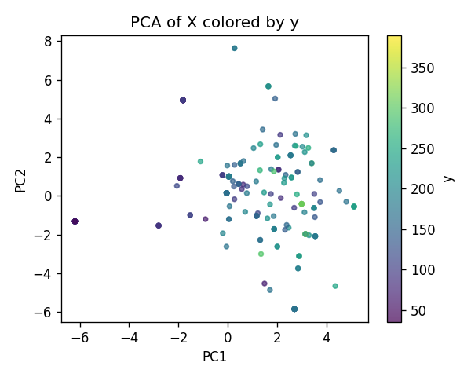
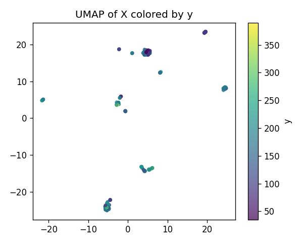
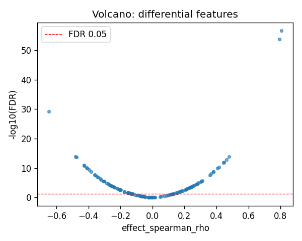
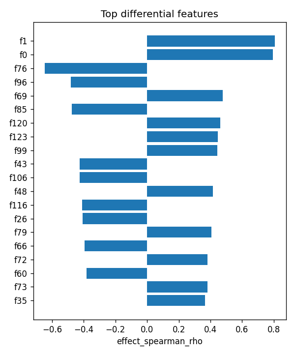

# RPS26|ENSG00000197728 | SAE-features vs ancestry

- task: **regression**, samples: 255, features: 128, groups: 255
- split: **GroupKFold** (5 folds), seed 0

## Held-out performance (point [95% CI])

| model | spearman | r2 |
|---|---|---|
| features / ridge | 0.750 [0.677, 0.804] | 0.607 [0.504, 0.685] |
| features / hist_gbt | 0.825 [0.774, 0.861] | 0.725 [0.652, 0.787] |

### Confound control

| model | spearman | r2 |
|---|---|---|
| covariates-only / ridge | 0.049 [-0.072, 0.164] | 0.034 [-0.014, 0.083] |
| covariates-only / hist_gbt | 0.049 [-0.072, 0.164] | 0.034 [-0.014, 0.083] |
| features-residualized / ridge | 0.562 [0.445, 0.660] | -1.977 [-3.528, -0.667] |
| features-residualized / hist_gbt | 0.818 [0.760, 0.854] | 0.716 [0.639, 0.779] |

*Interpretation:* features add signal beyond the covariates only if **features-residualized** stays above chance and the raw **features** model beats **covariates-only**.

## Permutation test (label-shuffle null)

- metric: **spearman** (ridge); permute within groups: True
- observed = **0.750**, null = -0.013 ± 0.078 (n=500)
- **p-value = 0.001996**

## Differential features (BH-FDR)

- significant at FDR<0.05: **82** of 128

| feature   |   stat_spearman_rho |   effect_spearman_rho |     p_value |    p_adj_bh | direction   |
|:----------|--------------------:|----------------------:|------------:|------------:|:------------|
| f1        |            0.805639 |              0.805639 | 1.84435e-59 | 2.36076e-57 | up          |
| f0        |            0.793003 |              0.793003 | 2.22411e-56 | 1.42343e-54 | up          |
| f76       |           -0.646307 |             -0.646307 | 1.50322e-31 | 6.41375e-30 | down        |
| f96       |           -0.481277 |             -0.481277 | 3.44303e-16 | 1.10177e-14 | down        |
| f69       |            0.478875 |              0.478875 | 5.05434e-16 | 1.29391e-14 | up          |
| f85       |           -0.475667 |             -0.475667 | 8.40145e-16 | 1.79231e-14 | down        |
| f120      |            0.461787 |              0.461787 | 7.1285e-15  | 1.3035e-13  | up          |
| f123      |            0.447354 |              0.447354 | 5.95649e-14 | 9.53038e-13 | up          |
| f99       |            0.44446  |              0.44446  | 9.00986e-14 | 1.2814e-12  | up          |
| f43       |           -0.427123 |             -0.427123 | 9.91299e-13 | 1.26886e-11 | down        |
| f106      |           -0.426298 |             -0.426298 | 1.10746e-12 | 1.28868e-11 | down        |
| f48       |            0.415581 |              0.415581 | 4.54297e-12 | 4.84584e-11 | up          |
| f116      |           -0.410937 |             -0.410937 | 8.24761e-12 | 8.12072e-11 | down        |
| f26       |           -0.407241 |             -0.407241 | 1.31707e-11 | 1.1239e-10  | down        |
| f79       |            0.407632 |              0.407632 | 1.25373e-11 | 1.1239e-10  | up          |

## Plots

- 
- 
- 
- 
