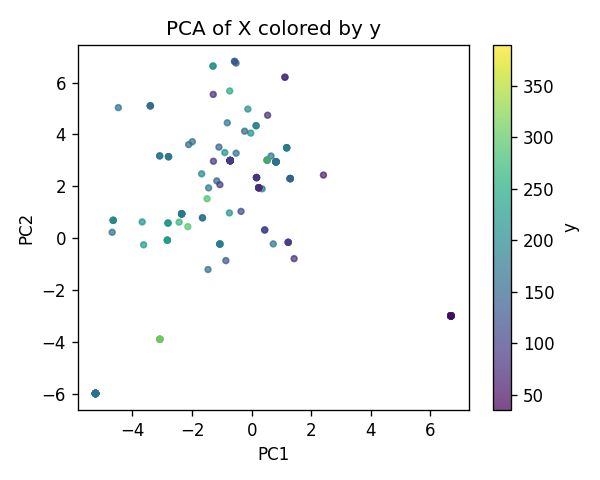
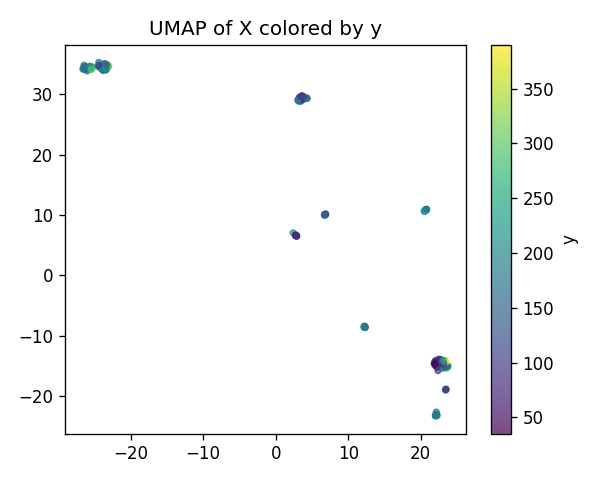
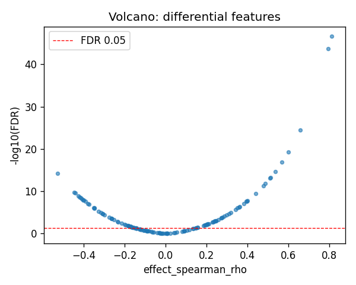
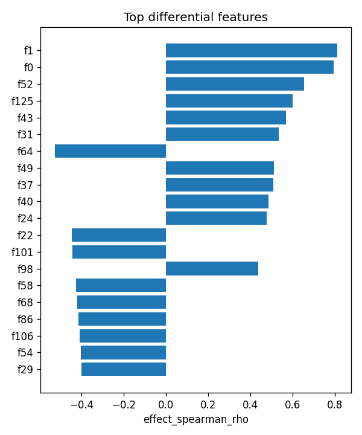

# RPS26|ENSG00000197728 (EUR-only) | SAE-features vs ancestry

- task: **regression**, samples: 207, features: 128, groups: 207
- split: **GroupKFold** (5 folds), seed 0

## Held-out performance (point [95% CI])

| model | spearman | r2 |
|---|---|---|
| features / ridge | 0.779 [0.725, 0.827] | 0.699 [0.608, 0.772] |
| features / hist_gbt | 0.784 [0.730, 0.825] | 0.745 [0.658, 0.804] |

### Confound control

| model | spearman | r2 |
|---|---|---|
| covariates-only / ridge | -0.097 [-0.239, 0.036] | -0.007 [-0.033, -0.002] |
| covariates-only / hist_gbt | -0.097 [-0.239, 0.036] | -0.007 [-0.033, -0.002] |
| features-residualized / ridge | 0.770 [0.704, 0.820] | 0.698 [0.600, 0.772] |
| features-residualized / hist_gbt | 0.792 [0.735, 0.834] | 0.749 [0.656, 0.811] |

*Interpretation:* features add signal beyond the covariates only if **features-residualized** stays above chance and the raw **features** model beats **covariates-only**.

## Permutation test (label-shuffle null)

- metric: **spearman** (ridge); permute within groups: True
- observed = **0.779**, null = -0.022 ± 0.091 (n=500)
- **p-value = 0.001996**

## Differential features (BH-FDR)

- significant at FDR<0.05: **84** of 128

| feature   |   stat_spearman_rho |   effect_spearman_rho |     p_value |    p_adj_bh | direction   |
|:----------|--------------------:|----------------------:|------------:|------------:|:------------|
| f1        |            0.810021 |              0.810021 | 2.06931e-49 | 2.64872e-47 | up          |
| f0        |            0.794275 |              0.794275 | 3.01925e-46 | 1.93232e-44 | up          |
| f52       |            0.655274 |              0.655274 | 8.94633e-27 | 3.8171e-25  | up          |
| f125      |            0.59829  |              0.59829  | 1.74056e-21 | 5.56981e-20 | up          |
| f43       |            0.567886 |              0.567886 | 4.52423e-19 | 1.1582e-17  | up          |
| f31       |            0.534037 |              0.534037 | 1.16687e-16 | 2.48932e-15 | up          |
| f64       |           -0.527    |             -0.527    | 3.42914e-16 | 6.27043e-15 | down        |
| f49       |            0.511727 |              0.511727 | 3.27142e-15 | 5.23427e-14 | up          |
| f37       |            0.50761  |              0.50761  | 5.8949e-15  | 8.38385e-14 | up          |
| f40       |            0.48557  |              0.48557  | 1.2098e-13  | 1.54854e-12 | up          |
| f24       |            0.475928 |              0.475928 | 4.24472e-13 | 4.93932e-12 | up          |
| f22       |           -0.445897 |             -0.445897 | 1.66084e-11 | 1.77156e-10 | down        |
| f101      |           -0.442334 |             -0.442334 | 2.50694e-11 | 2.46837e-10 | down        |
| f98       |            0.438036 |              0.438036 | 4.09353e-11 | 3.74266e-10 | up          |
| f58       |           -0.425946 |             -0.425946 | 1.56818e-10 | 1.33818e-09 | down        |

## Plots

- 
- 
- 
- 
