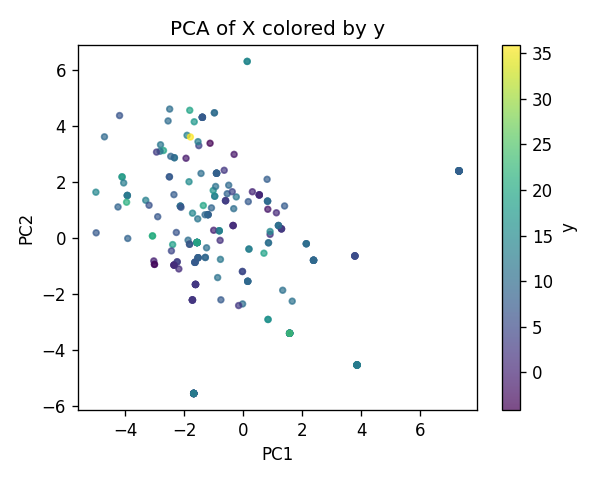
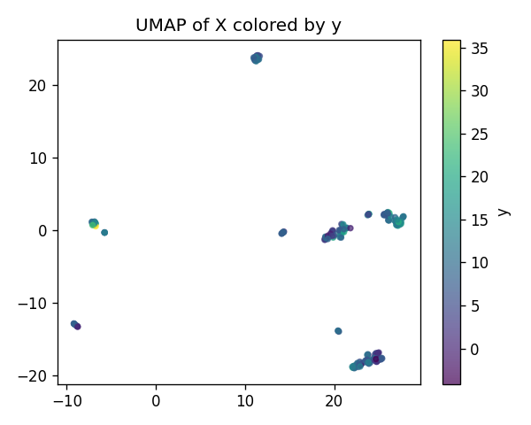
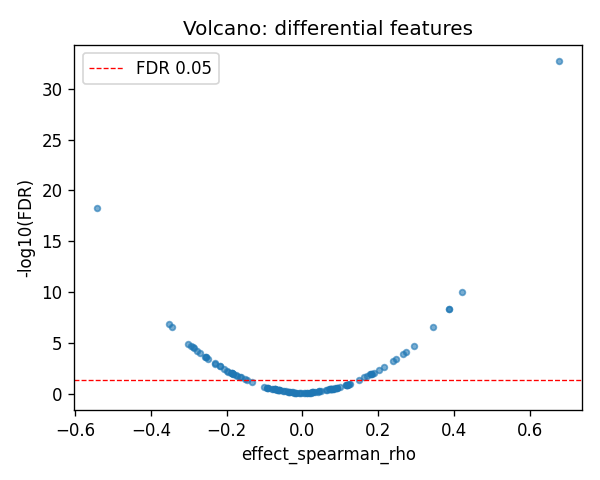
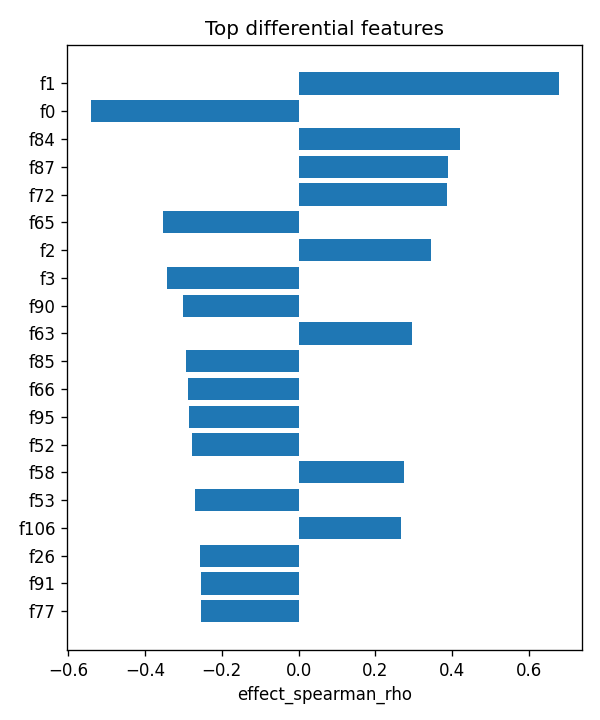

# SLFN5|ENSG00000166750 | SAE-features vs ancestry

- task: **regression**, samples: 255, features: 128, groups: 255
- split: **GroupKFold** (5 folds), seed 0

## Held-out performance (point [95% CI])

| model | spearman | r2 |
|---|---|---|
| features / ridge | 0.674 [0.586, 0.751] | 0.465 [0.294, 0.584] |
| features / hist_gbt | 0.726 [0.658, 0.782] | 0.503 [0.402, 0.597] |

### Confound control

| model | spearman | r2 |
|---|---|---|
| covariates-only / ridge | -0.063 [-0.181, 0.072] | -0.025 [-0.068, -0.001] |
| covariates-only / hist_gbt | -0.063 [-0.181, 0.072] | -0.025 [-0.068, -0.001] |
| features-residualized / ridge | 0.622 [0.528, 0.702] | 0.002 [-0.403, 0.314] |
| features-residualized / hist_gbt | 0.713 [0.642, 0.773] | 0.527 [0.410, 0.625] |

*Interpretation:* features add signal beyond the covariates only if **features-residualized** stays above chance and the raw **features** model beats **covariates-only**.

## Permutation test (label-shuffle null)

- metric: **spearman** (ridge); permute within groups: True
- observed = **0.674**, null = -0.012 ± 0.082 (n=500)
- **p-value = 0.001996**

## Differential features (BH-FDR)

- significant at FDR<0.05: **52** of 128

| feature   |   stat_spearman_rho |   effect_spearman_rho |     p_value |    p_adj_bh | direction   |
|:----------|--------------------:|----------------------:|------------:|------------:|:------------|
| f1        |            0.677063 |              0.677063 | 1.50067e-35 | 1.92086e-33 | up          |
| f0        |           -0.541231 |             -0.541231 | 8.30766e-21 | 5.3169e-19  | down        |
| f84       |            0.420171 |              0.420171 | 2.49719e-12 | 1.06547e-10 | up          |
| f87       |            0.387929 |              0.387929 | 1.38658e-10 | 4.43705e-09 | up          |
| f72       |            0.38596  |              0.38596  | 1.74786e-10 | 4.47453e-09 | up          |
| f65       |           -0.353307 |             -0.353307 | 6.5394e-09  | 1.39507e-07 | down        |
| f2        |            0.345444 |              0.345444 | 1.47429e-08 | 2.69584e-07 | up          |
| f3        |           -0.343177 |             -0.343177 | 1.85593e-08 | 2.96948e-07 | down        |
| f90       |           -0.301476 |             -0.301476 | 9.33637e-07 | 1.32784e-05 | down        |
| f63       |            0.294994 |              0.294994 | 1.62955e-06 | 2.08583e-05 | up          |
| f85       |           -0.293635 |             -0.293635 | 1.8283e-06  | 2.12747e-05 | down        |
| f66       |           -0.289092 |             -0.289092 | 2.67435e-06 | 2.85264e-05 | down        |
| f95       |           -0.285944 |             -0.285944 | 3.46744e-06 | 3.4141e-05  | down        |
| f52       |           -0.27773  |             -0.27773  | 6.72881e-06 | 6.15205e-05 | down        |
| f58       |            0.273324 |              0.273324 | 9.52052e-06 | 8.12418e-05 | up          |

## Plots

- 
- 
- 
- 
