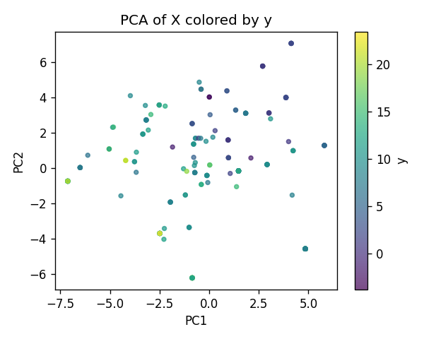
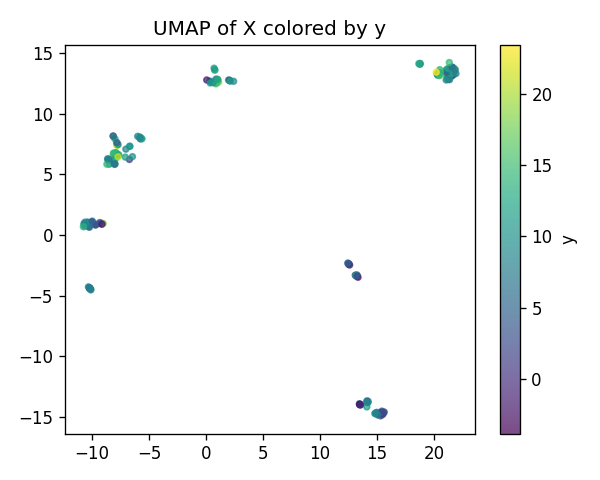
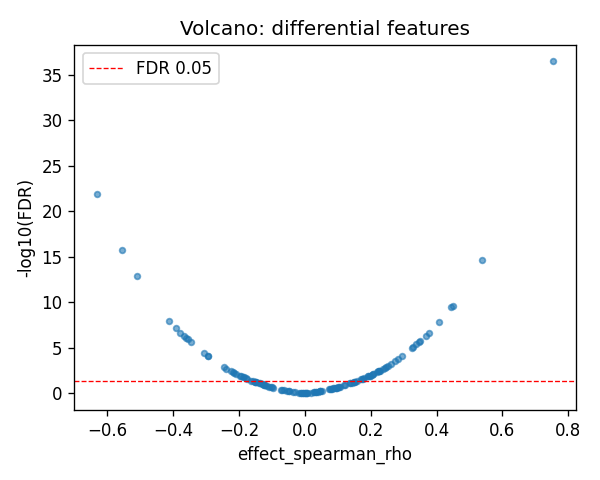
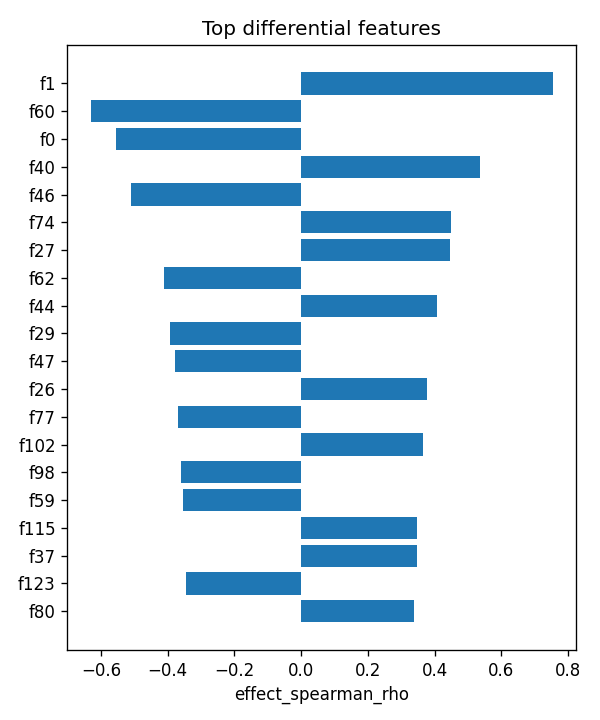

# SLFN5|ENSG00000166750 (EUR-only) | SAE-features vs ancestry

- task: **regression**, samples: 207, features: 128, groups: 207
- split: **GroupKFold** (5 folds), seed 0

## Held-out performance (point [95% CI])

| model | spearman | r2 |
|---|---|---|
| features / ridge | 0.725 [0.641, 0.791] | 0.567 [0.447, 0.648] |
| features / hist_gbt | 0.725 [0.636, 0.793] | 0.617 [0.532, 0.688] |

### Confound control

| model | spearman | r2 |
|---|---|---|
| covariates-only / ridge | -0.161 [-0.292, -0.045] | -0.024 [-0.052, -0.014] |
| covariates-only / hist_gbt | -0.161 [-0.292, -0.045] | -0.024 [-0.052, -0.014] |
| features-residualized / ridge | 0.724 [0.633, 0.789] | 0.564 [0.445, 0.649] |
| features-residualized / hist_gbt | 0.736 [0.655, 0.800] | 0.602 [0.517, 0.667] |

*Interpretation:* features add signal beyond the covariates only if **features-residualized** stays above chance and the raw **features** model beats **covariates-only**.

## Permutation test (label-shuffle null)

- metric: **spearman** (ridge); permute within groups: True
- observed = **0.725**, null = -0.012 ± 0.091 (n=500)
- **p-value = 0.001996**

## Differential features (BH-FDR)

- significant at FDR<0.05: **64** of 128

| feature   |   stat_spearman_rho |   effect_spearman_rho |     p_value |    p_adj_bh | direction   |
|:----------|--------------------:|----------------------:|------------:|------------:|:------------|
| f1        |            0.754194 |              0.754194 | 2.63084e-39 | 3.36747e-37 | up          |
| f60       |           -0.631104 |             -0.631104 | 2.13454e-24 | 1.36611e-22 | down        |
| f0        |           -0.554143 |             -0.554143 | 4.65266e-18 | 1.98513e-16 | down        |
| f40       |            0.537245 |              0.537245 | 7.07914e-17 | 2.26533e-15 | up          |
| f46       |           -0.509109 |             -0.509109 | 4.76172e-15 | 1.219e-13   | down        |
| f74       |            0.449346 |              0.449346 | 1.10983e-11 | 2.36763e-10 | up          |
| f27       |            0.444498 |              0.444498 | 1.95339e-11 | 3.57191e-10 | up          |
| f62       |           -0.41163  |             -0.41163  | 7.19176e-10 | 1.15068e-08 | down        |
| f44       |            0.408114 |              0.408114 | 1.03416e-09 | 1.4708e-08  | up          |
| f29       |           -0.392256 |             -0.392256 | 5.05446e-09 | 6.46971e-08 | down        |
| f47       |           -0.377881 |             -0.377881 | 1.9843e-08  | 2.309e-07   | down        |
| f26       |            0.376658 |              0.376658 | 2.22244e-08 | 2.3706e-07  | up          |
| f77       |           -0.368477 |             -0.368477 | 4.68696e-08 | 4.61485e-07 | down        |
| f102      |            0.366543 |              0.366543 | 5.57445e-08 | 5.09664e-07 | up          |
| f98       |           -0.36096  |             -0.36096  | 9.13749e-08 | 7.79732e-07 | down        |

## Plots

- 
- 
- 
- 
