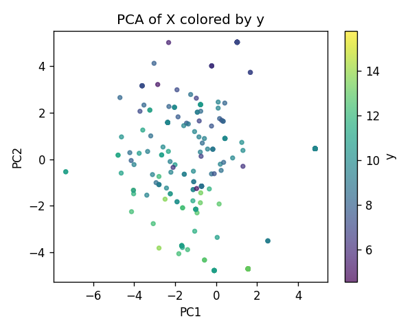
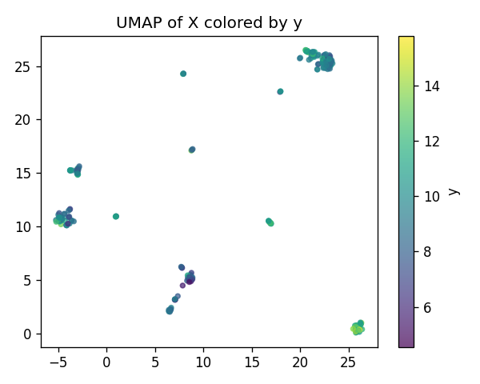
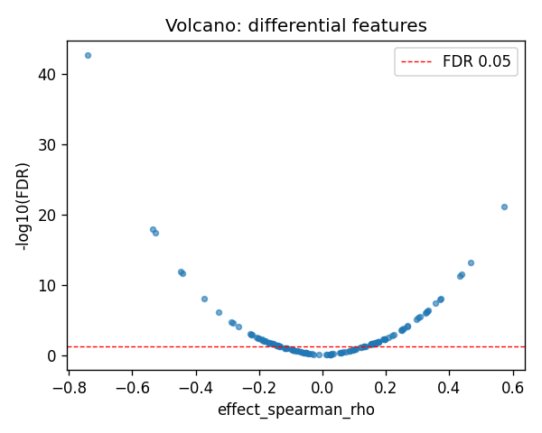
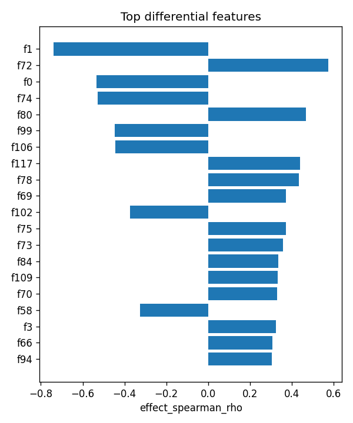

# ZNF266|ENSG00000174652 | SAE-features vs ancestry

- task: **regression**, samples: 255, features: 128, groups: 255
- split: **GroupKFold** (5 folds), seed 0

## Held-out performance (point [95% CI])

| model | spearman | r2 |
|---|---|---|
| features / ridge | 0.715 [0.634, 0.779] | 0.469 [0.333, 0.573] |
| features / hist_gbt | 0.777 [0.700, 0.828] | 0.590 [0.486, 0.660] |

### Confound control

| model | spearman | r2 |
|---|---|---|
| covariates-only / ridge | -0.007 [-0.127, 0.104] | -0.013 [-0.050, 0.012] |
| covariates-only / hist_gbt | -0.007 [-0.127, 0.104] | -0.013 [-0.050, 0.012] |
| features-residualized / ridge | 0.635 [0.525, 0.722] | -0.072 [-0.592, 0.292] |
| features-residualized / hist_gbt | 0.775 [0.697, 0.825] | 0.576 [0.463, 0.643] |

*Interpretation:* features add signal beyond the covariates only if **features-residualized** stays above chance and the raw **features** model beats **covariates-only**.

## Permutation test (label-shuffle null)

- metric: **spearman** (ridge); permute within groups: True
- observed = **0.715**, null = -0.022 ± 0.079 (n=500)
- **p-value = 0.001996**

## Differential features (BH-FDR)

- significant at FDR<0.05: **76** of 128

| feature   |   stat_spearman_rho |   effect_spearman_rho |     p_value |    p_adj_bh | direction   |
|:----------|--------------------:|----------------------:|------------:|------------:|:------------|
| f1        |           -0.739671 |             -0.739671 | 2.05179e-45 | 2.62629e-43 | down        |
| f72       |            0.573387 |              0.573387 | 1.08919e-23 | 6.97079e-22 | up          |
| f0        |           -0.535231 |             -0.535231 | 2.65297e-20 | 1.13193e-18 | down        |
| f74       |           -0.527595 |             -0.527595 | 1.12511e-19 | 3.60036e-18 | down        |
| f80       |            0.467772 |              0.467772 | 2.86896e-15 | 7.34453e-14 | up          |
| f99       |           -0.447503 |             -0.447503 | 5.83061e-14 | 1.24386e-12 | down        |
| f106      |           -0.442871 |             -0.442871 | 1.12882e-13 | 2.06413e-12 | down        |
| f117      |            0.439835 |              0.439835 | 1.73124e-13 | 2.76999e-12 | up          |
| f78       |            0.433586 |              0.433586 | 4.1199e-13  | 5.85942e-12 | up          |
| f69       |            0.372078 |              0.372078 | 8.56609e-10 | 9.96781e-09 | up          |
| f102      |           -0.372441 |             -0.372441 | 8.22523e-10 | 9.96781e-09 | down        |
| f75       |            0.369923 |              0.369923 | 1.08904e-09 | 1.16165e-08 | up          |
| f73       |            0.35706  |              0.35706  | 4.40148e-09 | 4.33377e-08 | up          |
| f84       |            0.334096 |              0.334096 | 4.58346e-08 | 4.19059e-07 | up          |
| f109      |            0.330389 |              0.330389 | 6.57386e-08 | 5.6097e-07  | up          |

## Plots

- 
- 
- 
- 
