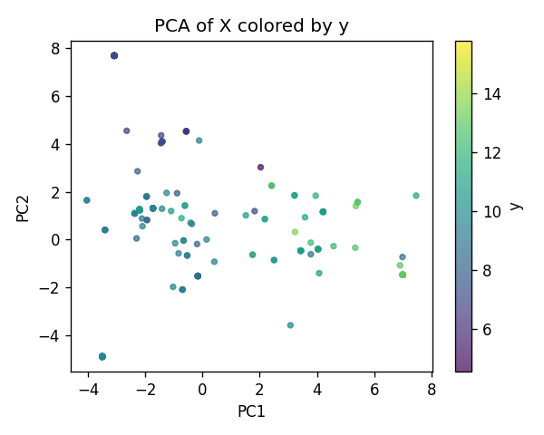
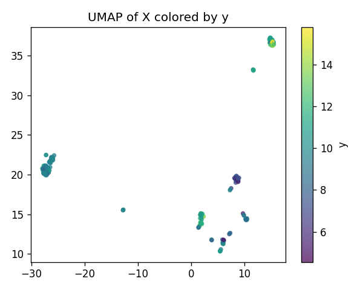
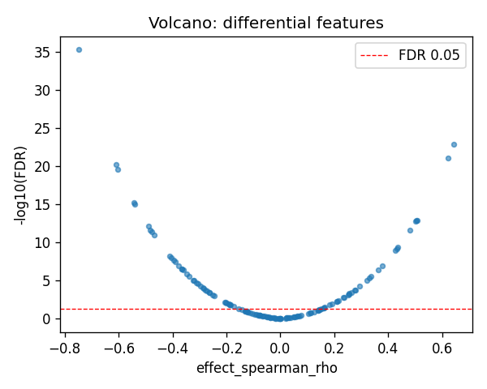
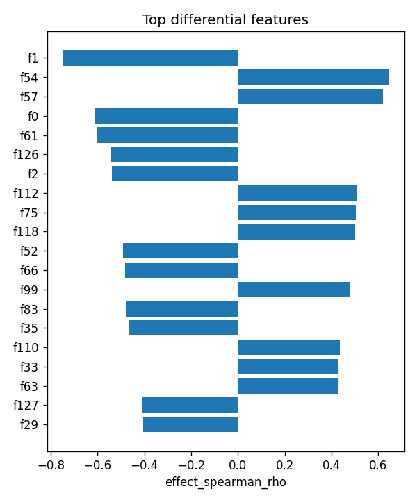

# ZNF266|ENSG00000174652 (EUR-only) | SAE-features vs ancestry

- task: **regression**, samples: 207, features: 128, groups: 207
- split: **GroupKFold** (5 folds), seed 0

## Held-out performance (point [95% CI])

| model | spearman | r2 |
|---|---|---|
| features / ridge | 0.784 [0.713, 0.832] | 0.560 [0.441, 0.662] |
| features / hist_gbt | 0.773 [0.693, 0.832] | 0.610 [0.490, 0.691] |

### Confound control

| model | spearman | r2 |
|---|---|---|
| covariates-only / ridge | -0.136 [-0.269, 0.004] | -0.007 [-0.036, -0.002] |
| covariates-only / hist_gbt | -0.136 [-0.269, 0.004] | -0.007 [-0.036, -0.002] |
| features-residualized / ridge | 0.777 [0.702, 0.829] | 0.548 [0.425, 0.655] |
| features-residualized / hist_gbt | 0.763 [0.678, 0.821] | 0.613 [0.499, 0.693] |

*Interpretation:* features add signal beyond the covariates only if **features-residualized** stays above chance and the raw **features** model beats **covariates-only**.

## Permutation test (label-shuffle null)

- metric: **spearman** (ridge); permute within groups: True
- observed = **0.784**, null = -0.032 ± 0.089 (n=500)
- **p-value = 0.001996**

## Differential features (BH-FDR)

- significant at FDR<0.05: **72** of 128

| feature   |   stat_spearman_rho |   effect_spearman_rho |     p_value |    p_adj_bh | direction   |
|:----------|--------------------:|----------------------:|------------:|------------:|:------------|
| f1        |           -0.746646 |             -0.746646 | 3.79189e-38 | 4.85362e-36 | down        |
| f54       |            0.642331 |              0.642331 | 1.78417e-25 | 1.14187e-23 | up          |
| f57       |            0.62039  |              0.62039  | 2.07819e-23 | 8.86693e-22 | up          |
| f0        |           -0.609632 |             -0.609632 | 1.87315e-22 | 5.99407e-21 | down        |
| f61       |           -0.601845 |             -0.601845 | 8.73743e-22 | 2.23678e-20 | down        |
| f126      |           -0.543626 |             -0.543626 | 2.57812e-17 | 5.49998e-16 | down        |
| f2        |           -0.540185 |             -0.540185 | 4.4571e-17  | 8.15012e-16 | down        |
| f112      |            0.506267 |              0.506267 | 7.1315e-15  | 1.14104e-13 | up          |
| f75       |            0.505046 |              0.505046 | 8.47216e-15 | 1.20493e-13 | up          |
| f118      |            0.501514 |              0.501514 | 1.3897e-14  | 1.77882e-13 | up          |
| f52       |           -0.490344 |             -0.490344 | 6.40325e-14 | 7.45106e-13 | down        |
| f66       |           -0.481442 |             -0.481442 | 2.08054e-13 | 2.21925e-12 | down        |
| f99       |            0.480006 |              0.480006 | 2.50832e-13 | 2.46973e-12 | up          |
| f83       |           -0.475993 |             -0.475993 | 4.20957e-13 | 3.84875e-12 | down        |
| f35       |           -0.467986 |             -0.467986 | 1.15936e-12 | 9.89316e-12 | down        |

## Plots

- 
- 
- 
- 
